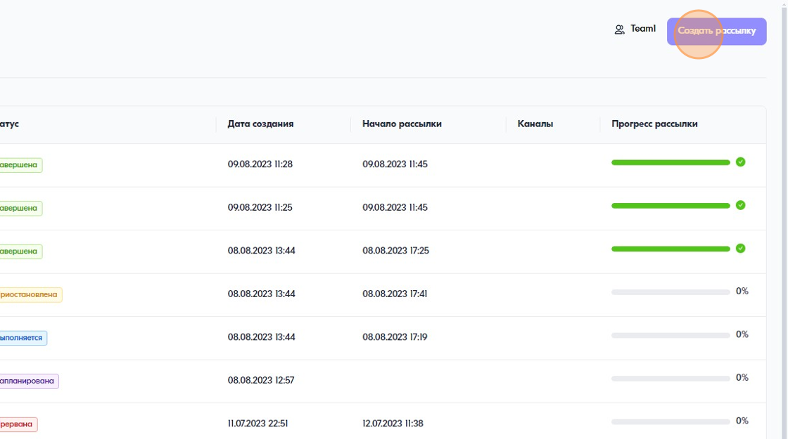
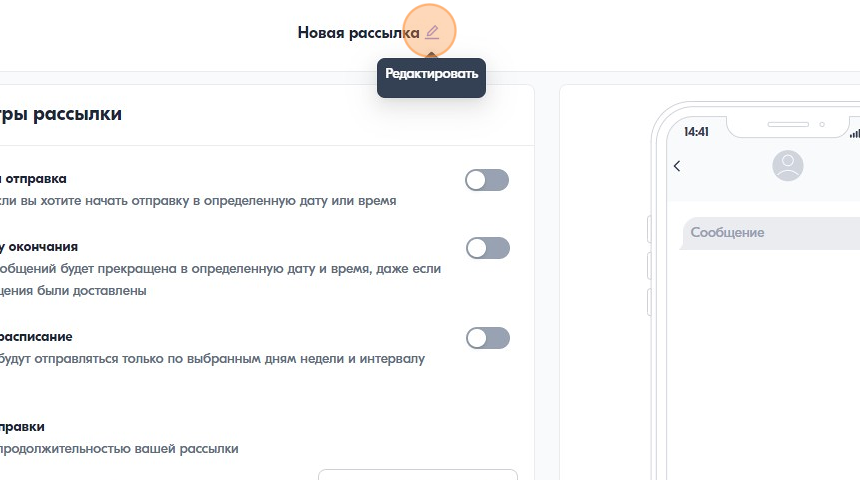
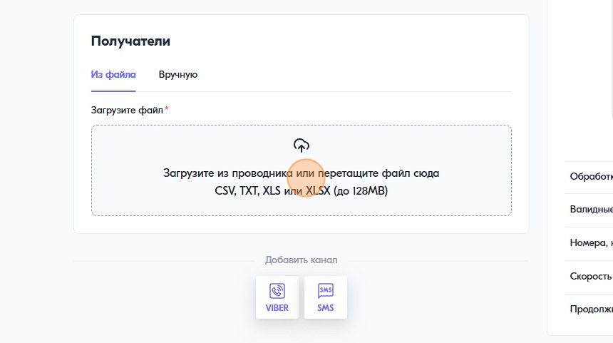
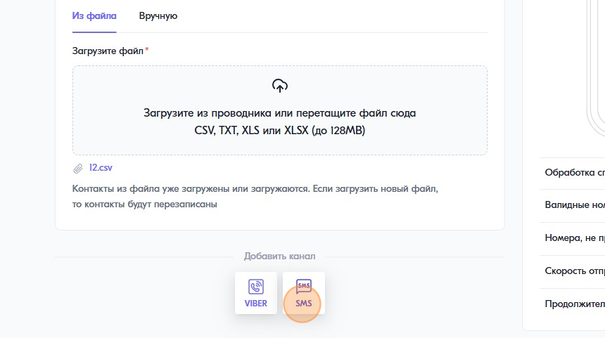
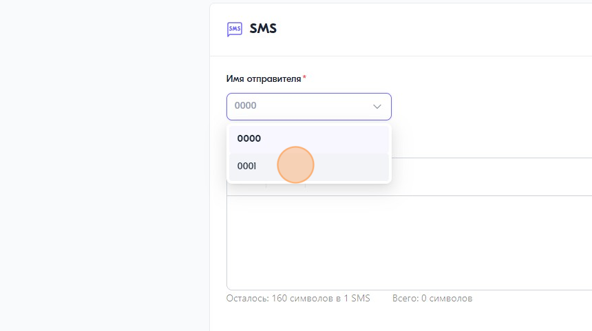
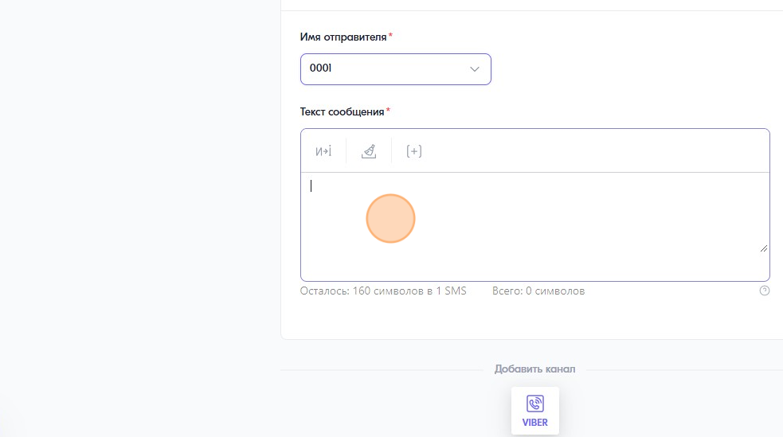
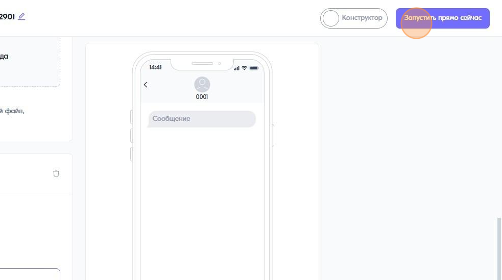

Как создать SMS-рассылку 
========================
 
 
1\. Перейдите в "Рассылки" и нажмите "Создать рассылку"
 

 
 
2\. Придумайте название для расски
 

 
 
3\. Загрузите файл с контактами или укажите номера вручную.
 

 
 
4\. Если индикатор обработки списка контактов стал зеленым, значит файл загружен. Под индикатором видно на какое количество номеров будет отправлено сообщение, а какие номера не прошли валидацию и не будут участвовать в рассылке. При необходимости можно скачать файл со списоком ошибок загрузки номеров
 
.. image:: media/sms_sender4.jpeg
 
 
5\. Добавьте канал отправки сообщений
 

 
 
6\. Выберите имя отправителя из списка
 

 
 
7\. Введите текст сообщения
 

 
 
8\. Запустите рассылку
 

 
 
