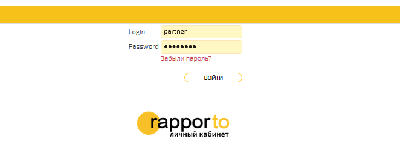
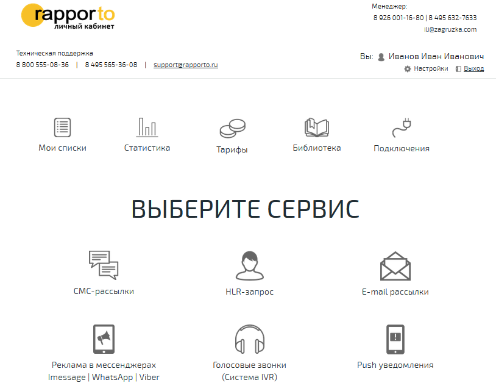
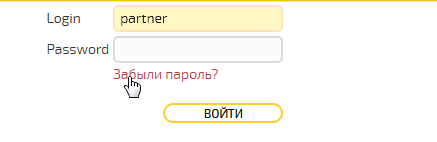
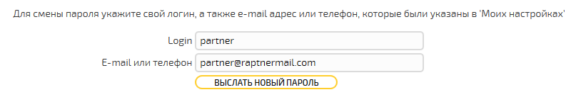
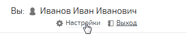
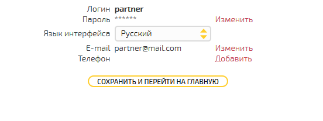
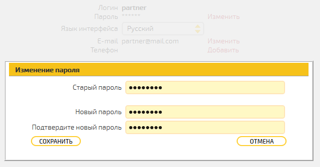
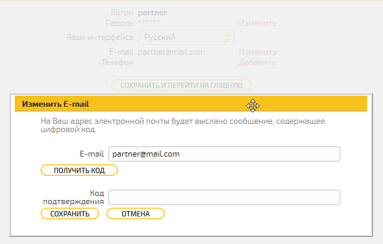
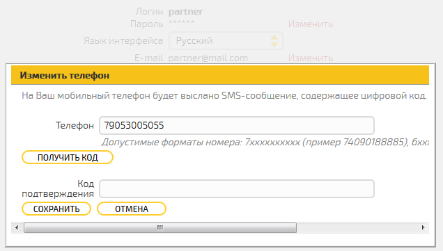

Подключение к личному кабинету
==============================

В данном разделе приведено описание первоначальных настроек Личного
кабинета пользователя платформы Раппорто.

Для работы с сервисами платформы Раппорто пользователю необходимо
заключить договор.

Платформа Раппорто предоставляет следующие функциональные возможности:

-  создание рассылок сообщений разных типов;

-  загрузку, удаление и редактирование списков абонентов;

-  просмотр тарифной информации;

-  формирование отчётов и просмотр статистики.

Доступ в Личный кабинет 
------------------------

Личный кабинет размещён по адресу http://lk.rapporto.ru/.

Для доступа в Личный кабинет ответственный сотрудник Раппорто должен
сообщить пользователю логин и пароль.

Вход в Личный кабинет 
------------------------

Для входа в Личный кабинет пользователю необходимо ввести логин и
пароль, полученные при регистрации:

.. raw:: html

     

       

         

             
         

       

     

|image0|

.. raw:: html

     

       

         

             
         

       

     

Нажать на кнопку **<ВОЙТИ>**, после чего откроется страница с доступными
разделами Личного кабинета:

.. raw:: html

     

       

         

             
         

       

     

|image1|

.. raw:: html

     

       

         

             
         

       

     

Для выхода из Личного кабинета следует нажать на кнопку **<Выход>** в
правом верхнем углу открывшегося окна.

Восстановление пароля
------------------------

При утере пароля для входа в Личный кабинет, на стартовой странице
следует перейти по ссылке **"Забыли пароль?"**:

.. raw:: html

     

       

         

             
         

       

     

|image2|

.. raw:: html

     

       

         

             
         

       

     

В поле **"Login"** необходимо ввести логин пользователя, а в поле ниже –
телефон или адрес электронной почты, привязанный к аккаунту
пользователя:

.. raw:: html

     

       

         

             
         

       

     

|image3|

.. raw:: html

     

       

         

             
         

       

     

Нажать на кнопку **<ВЫСЛАТЬ НОВЫЙ ПАРОЛЬ>**. На указанный телефон или
адрес электронной почты будет отправлено сообщение с новым автоматически
сгенерированным паролем.

Настройки Личного кабинета
---------------------------

Для изменения персональных настроек, таких, как пароль, язык интерфейса,
телефон и адрес электронной почты следует нажать на кнопку
**<Настройки>** в правом верхнем углу главное окна:

.. raw:: html

     

       

         

             
         

       

     

|image4|

.. raw:: html

     

       

         

             
         

       

     

Откроется окно изменения настроек:

.. raw:: html

     

       

         

             
         

       

     

|image5|

.. raw:: html

     

       

         

             
         

       

     

Для изменения пароля пользователя нужно нажать **<Изменить>** справа от
поля с паролем. Откроется окно изменения пароля:

.. raw:: html

     

       

         

             
         

       

     

|image6|

.. raw:: html

     

       

         

             
         

       

     

В открывшемся окне следует ввести текущий пароль в поле *«*\ **Старый
пароль»,** далее – ввести новый пароль с подтверждением в
соответствующие поля, после чего нажать кнопку **<СОХРАНИТЬ>**.

Для изменения локализации в выпадающем списке *«*\ **Язык
интерфейса**\ *»* нужно выбрать нужный язык. В текущей реализации
доступны русский и английский языки.

Для изменения адреса электронной почты нужно нажать **<Изменить>**
справа от поля **«E-mail»**:

.. raw:: html

     

       

         

             
         

       

     

|image7|

.. raw:: html

     

       

         

             
         

       

     

В открывшемся окне в поле **«E-mail»** нужно ввести новый адрес и нажать
кнопку **<ПОЛУЧИТЬ КОД>**, после чего код подтверждения будет выслан на
указанный электронный адрес. Полученный код необходимо ввести в поле
**«Код подтверждения»** и нажать кнопку **<СОХРАНИТЬ>**.

Для добавления номера телефона нужно нажать **<Добавить>** (или
**<Изменить>** если телефон уже задан) справа от поля *«*\ **Телефон»**:

.. raw:: html

     

       

         

             
         

       

     

|image8|

.. raw:: html

     

       

         

             
         

       

     

В открывшемся окне в поле **«Телефон»** нужно ввести номер телефона и
нажать кнопку **<ПОЛУЧИТЬ КОД>**, после чего код подтверждения будет
выслан на указанный номер телефона. Полученный код необходимо ввести в
поле **«Код подтверждения»** и нажать кнопку **<СОХРАНИТЬ>**.

После внесения всех необходимых данных изменения следует сохранить, для
этого необходимо нажать на кнопку **<СОХРАНИТЬ И ПЕРЕЙТИ НА ГЛАВНУЮ>**.

