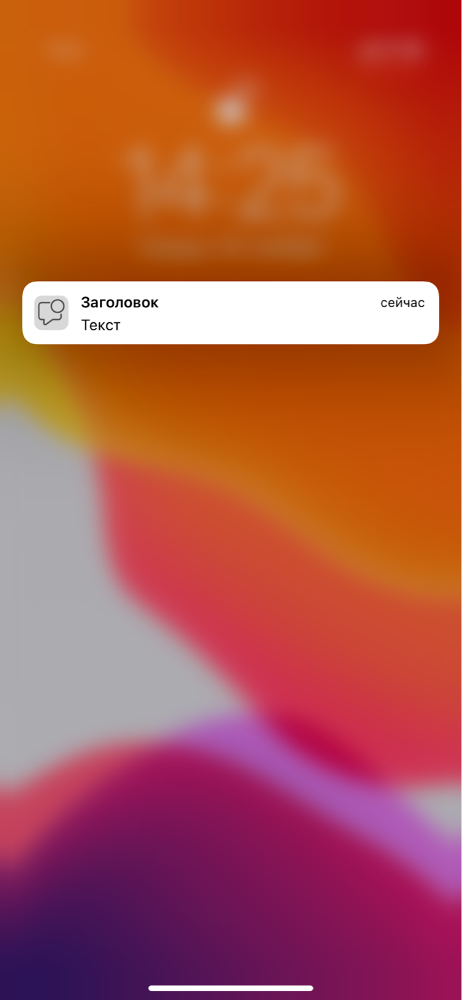
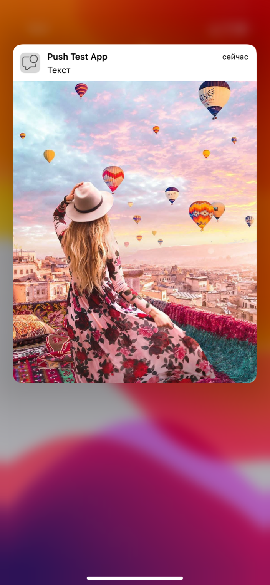
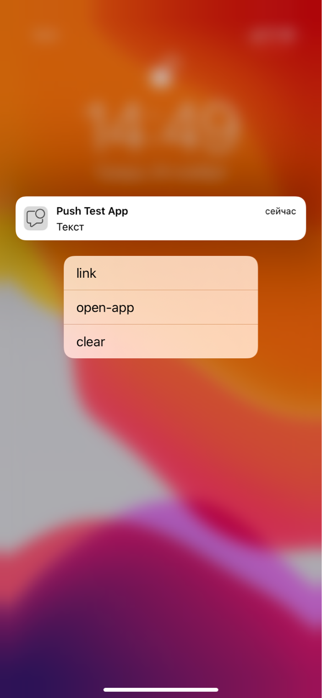
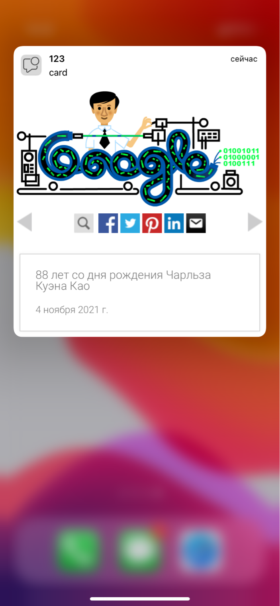

Сервис RPNS
====================================

Rapporto Push Notification System (далее RPNS) — это сервис, который позволяет управлять:

*  отправкой PUSH-сообщениями на мобильные приложения;

*  получением статусов отправки этих сообщений.

Технические возможности PUSH-сообщений позволяют разрабатывать более продуктивную и гибкую к поведению пользователя маркетинговую стратегию.

Сервис имеет следующие возможности:

*  отправка PUSH-сообщения как по номеру телефона, так и идентификатору пользователя в системе Партнёра;

*  отправка PUSH-сообщения с заголовками и текстом (см. рис. 1);

*  отправка PUSH-сообщения с изображениями (см. рис. 2);

*  отправка PUSH-сообщения с кнопками (см. рис. 3);

*  отправка PUSH-сообщения с webview – при открытии PUSH-сообщения пользователем выполняется переход на веб-ресурс или внутреннюю страницу приложения (см. рис. 4);

*  настройка подписок на уровне приложения (сегментирование клиентской базы, типизация трафика);

*  отображение истории PUSH–сообщений;

*  детализирование статусов PUSH–сообщений;

*  определять опциональный признак основного устройства, который позволяет осуществить как веерную доставку на несколько устройств, так и на одно основное;

*  осуществлять массовые рассылки сообщений по времени с отправкой в будущем;

*  отправка PUSH–сообщений с привязкой к часовому поясу получателя.

.. raw:: html

   

       Рисунок 1. PUSH с заголовками и текстом.
   

.. raw:: html

     

       

         

             
         

       

     

.. raw:: html

   

     Рисунок 2. PUSH с изображенем.
   

.. raw:: html

     

       

         

             
         

       

     

.. raw:: html

   

    Рисунок 3. PUSH с кнопками.
   

.. raw:: html

     

       

         

             
         

       

     

.. raw:: html

   

    Рисунок 4. PUSH с webview.
   

.. raw:: html

     

       

         

             
         

       

     

.. .. raw:: html

..      

..        

..          

..             
..             <figcaption>Рисунок 1. PUSH с заголовками и текстом.</figcaption>
..          

..          

..             
..             <figcaption>Рисунок 2. PUSH с изображенем.</figcaption>
..          

..        

..      

.. .. raw:: html

..      

..        

..          

..              
..          

..        

..      

.. .. raw:: html

..      

..        

..          

..             
..             <figcaption>Рисунок 3. PUSH с кнопками.</figcaption>
..          

..          

..             
..             <figcaption>Рисунок 4. PUSH с webview.</figcaption>
..          

..        

..      

.. .. raw:: html

..      

..        

..          

..              
..          

..        

..      

Данный сервис дает возможность экономии средств за счет использования канала связи для отправки PUSH-сообщений вместо SMS-сообщений и также дает возможность настраивать гибкие каскады для отправки в разные каналы связи. PUSH Service поддерживает подключение PUSH–сообщений для устройств на базе Android и iOS. Для включения PUSH–сообщений необходимо предоставить сертификаты/приватные ключи Ваших мобильных приложений.  

Отправка PUSH-сообщения выполняется по REST-протоколу, подробное описание протокола смотрите в разделе документации Интеграция по REST-протоколу.

