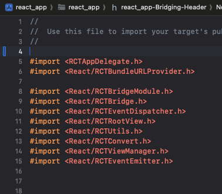
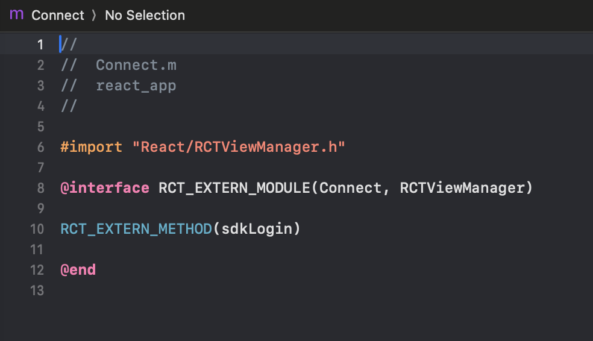
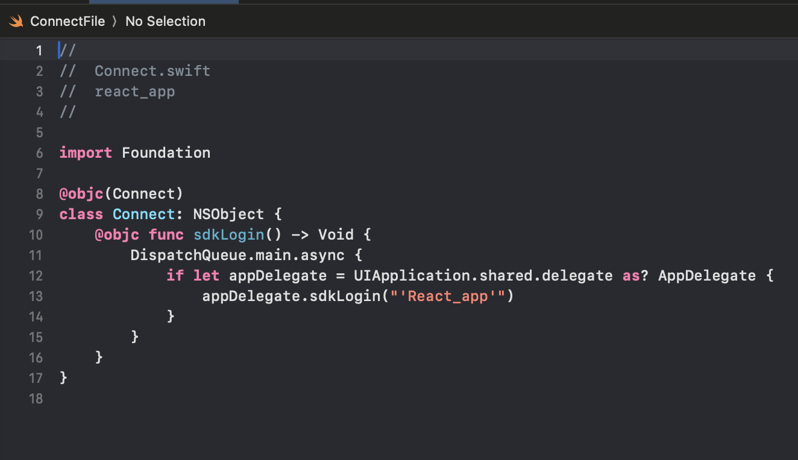
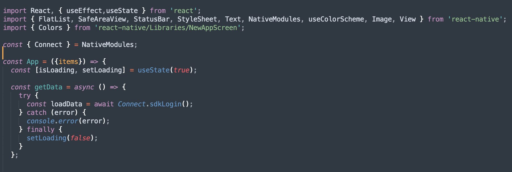
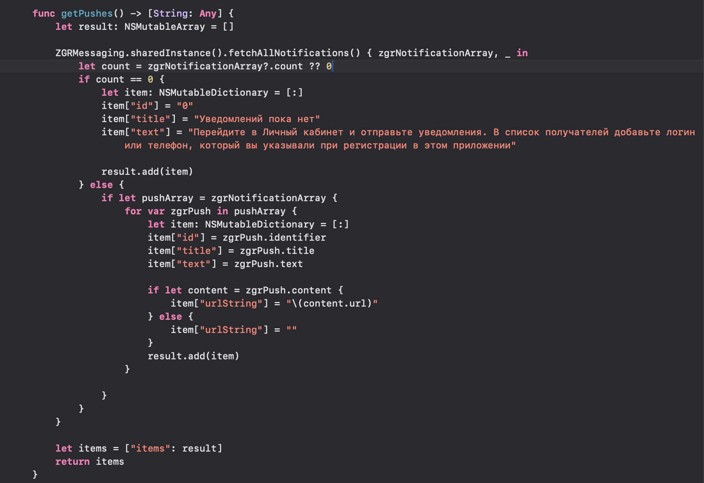

Использование библиотеки ZGRImSDK в мобильном приложении, основанном на фреймворке React Native
=================================================================================================

.. raw:: html
   
   
Рекомендуется тщательно ознакомиться с документацией по 
       <a href="https://reactnative.dev" target="_blank" class="button">
            React Native.
       </a>
   

   

Взаимодействие Swift и React Native
----------------------------------------

Для того, чтобы Swift заработал в React Native-проекте, нужно создать bridge-файл. XCode предложит сделать это автоматически при создании первого swift-файла.
Примерное содержание файла *react_app-Bridging-Header.h*:

Взаимодействие между кодом React Native и iOS-частью (obj-C/swift) можно обеспечить с помощью вспомогательного файла Connect.

Допустим, необходимо вызвать из js-кода функцию ``sdkLogin()``, определенную в файле *AppDelegate.swift*:

.. image:: media/rn_2_.png

В основной папке iOS-части проекта необходимо создать файлы *Connect.m* и *ConnectFile.swift*, в которых нужно объявить внешние (extern) по отношению к js-коду методы.  

.. image:: media/rn_3_.png

При разработке каждый экспортируемый в JavaScript элемент должен быть помечен атрибутом ``@objc``, чтобы его можно было использовать в Objective-C runtime.

Также необходимо импортировать *NativeModules* и объявить ``const { Connect } = NativeModules;``.

После этого функция ``sdkLogin()`` доступна в js-коде через вызов ``Connect.sdkLogin()``:

Библиотека ZGRImSDK в приложении
------------------------------------

Допустим, необходимо в приложении, написанном на React Native, отобразить историю push-уведомлений, полученную с помощью вызова метода ``fetchAllNotifications()`` нашего SDK. Одним из решений может быть использование класса ``RCTRootView``, необходимый массив данных для отображения которому будет передан в качестве параметра ``initialProperties``, как в данном примере:

.. image:: media/rn_7_.png

Код для функции ``getPushes()`` мог бы выглядеть примерно так:

