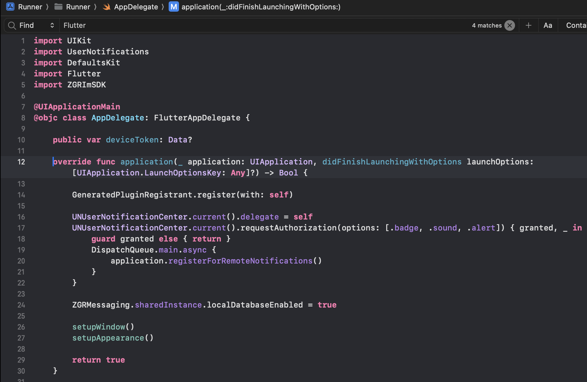
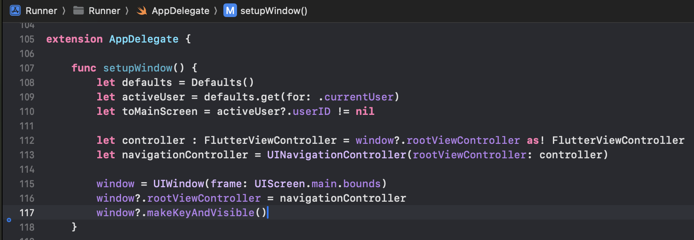

Использование библиотеки ZGRImSDK в мобильном приложении, основанном на фреймворке Flutter
=============================================================================================

Рекомендуется тщательно ознакомиться с документацией по Flutter:

* https://flutter.dev,
* https://flutter.dev/multi-platform/ios. 

Интеграция SDK в приложение
-----------------------------

Для интеграции ZGRImSDK в приложение, основанное на фреймворке Flutter, достаточно просто импортировать SDK в необходимый файл (например, в файл AppDelegate). 
    

    
При этом функция ``setupWindow()`` могла бы выглядеть примерно так:

