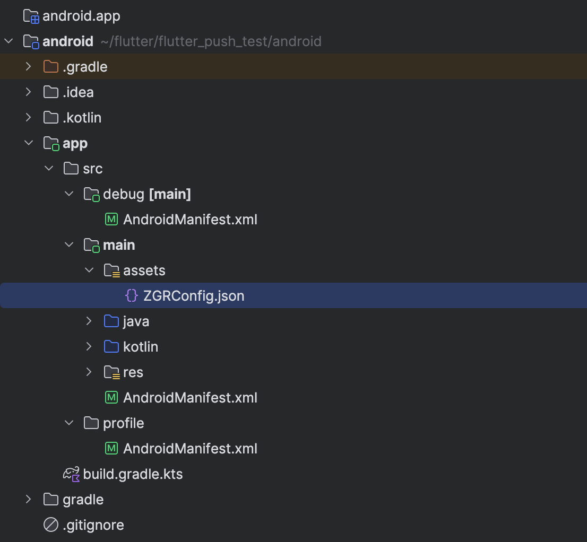
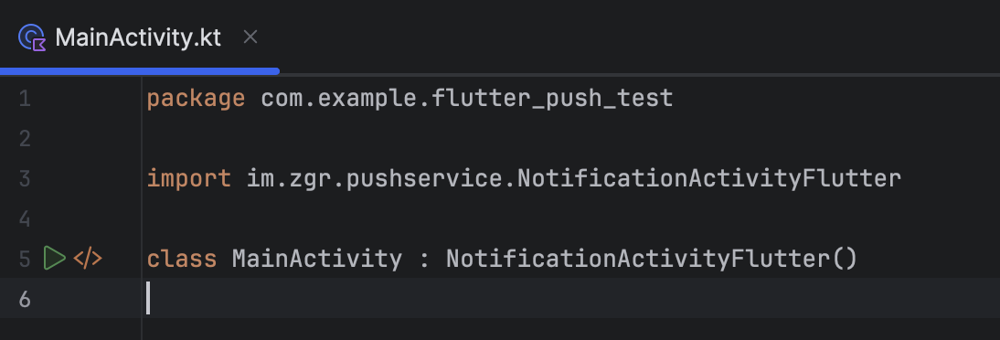

Интеграция PushService в приложение на базе Flutter
======================================================

Добавление конфигурационных файлов
------------------------------------

Все связанные настройки доступа содержатся в файле ``ZGRConfig.json``, который необходимо разместить в папке assets Android-проекта:

Подключение библиотеки к проекту
----------------------------------

Доступ к библиотеке осуществляется через репозиторий Nexus, подключение к которому настраивается в файле ``settings.gradle.kts``.

В полях ``username`` и ``password`` необходимо указать значения, предоставленные :ref:`Службой технической поддержки <support>`:

.. code-block:: kotlin

   // settings.gradle.kts
   pluginManagement {  
       ...
   }  

   dependencyResolutionManagement {  
       repositoriesMode.set(RepositoriesMode.PREFER_SETTINGS)  
       repositories {  
           google()  
           mavenCentral()  
           gradlePluginPortal()  
           maven {  
               url = uri("https://storage.googleapis.com/download.flutter.io")  
           }  
           maven {  
               url = uri(
                   "https://nexus-external.rapporto.ru/repository/maven-group-1"
               )
               credentials {
                   username = "USERNAME"
                   password = "PASSWORD"
               }
           }
       }
   }

   plugins {
       ...
   }

   include(":app")

Далее необходимо подключить библиотеку к проекту. Для этого в файл ``app/build.gradle.kts`` следует добавить соответствующую зависимость. 

Вместо ``lib_version`` необходимо указать актуальную версию библиотеки, информацию о которой также предоставит Служба технической поддержки:

.. code-block:: kotlin

   android {
       ...
       dependencies {
           implementation("com.zagruzka:pushservice-google:lib_version")
       }
   }

Использование библиотеки
--------------------------

Для начала работы с библиотекой в основном классе Android-проекта (по умолчанию – ``MainActivity.kt``) необходимо изменить родительский класс с ``FlutterActivity`` на ``NotificationActivityFlutter`` из библиотеки:

Дальнейшее использование библиотеки организовано в соответствии с :doc:`основной инструкцией <install_sdk_android>`.
