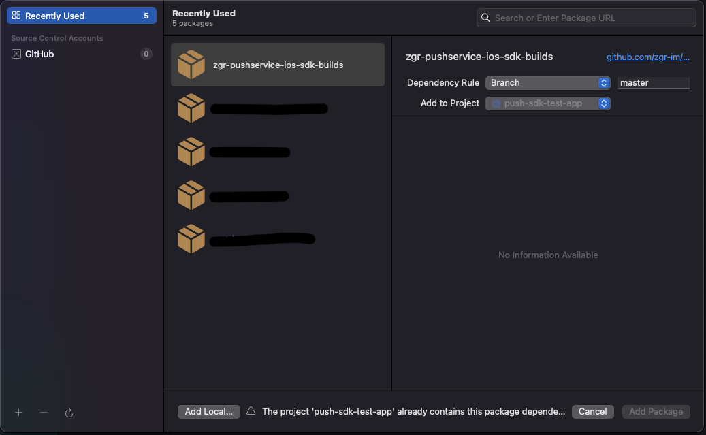
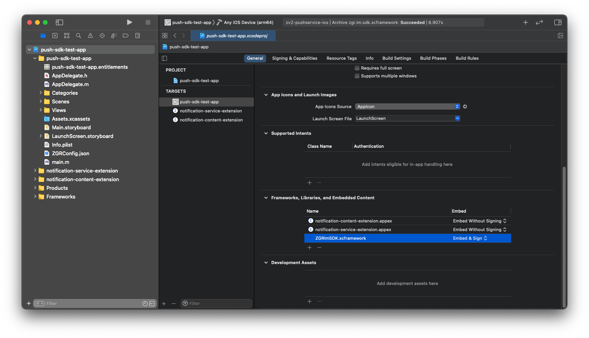

Интеграция библиотеки ZGRImSDK c помощью Swift Package Manager
================================================================

Для настройки основного приложения необходимо выполнить следующее:

1. Перетянуть полученный от ZGR конфигурационный файл ``ZGRConfig.json`` в иерархию файлов проекта (левая панель в Xcode).
2. Активировать чек-бокс **“Copy items if needed”**.
3. Выбрать в меню **“Files/Swift Packages/Add Package Dependency...”**.
4. Во всплывающем окне указать правильный путь до репозитория, выбрать необходимые опции (или оставить всё по умолчанию) и подключить пакет к таргету приложения.   

5. Перейти в основные настройки таргета приложения (первая вкладка) к разделу **“Frameworks, Libraries and Embedded Content”**, нажать **<+>**.
6. В открывшемся меню выбрать библиотеку ``ZGRImSDK.xcframework``, нажать **<Add>**.
7. Убедиться, что библиотека будет копироваться в бандл вашего приложения посредством установки пункта **“Embed & Sign”**.

    
Дальнейшие шаги по интеграции библиотеки в части создания и настройки расширений, а также настройки App Group идентичны описанным в статье :doc:`manually_install`, начиная с раздела :ref:`creating_app_extensions`.
