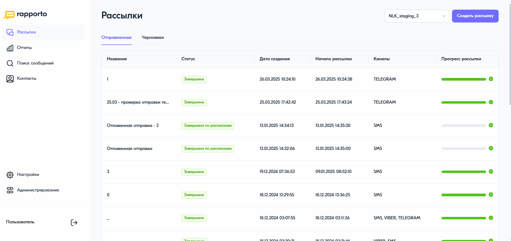

Добавление черного списка
===========================

Функционал личного кабинета Rapporto позволяет исключить номера абонентов из списка рассылок, добавив их в черный список. При создании и запуске рассылки отправка сообщений на такие номера не будет выполнена.

Для добавления номера в черный список необходимо выполнить следующее:
 
1. В личном кабинете перейти в раздел **"Контакты"**, нажав на соответствующую иконку в левом меню страницы.

2. В открывшемся разделе перейти на вкладку **"Черный список"**.
 
3. В правом верхнем углу нажать на кнопку **<Добавить>** и выбрать способ добавления контакта — один номер телефона или загрузка из файла:

.. tabs::

   .. tab:: добавление одного контакта

      * в открывшейся форме указать номер телефона абонента и при необходимости причину добавления контакта в черный список в поле **"Примечание"**;
      * нажать на кнопку **<Добавить>**.
  

   .. tab:: загрузка файла

      * в открывшейся форме нажать на область загрузки и выбрать файл в формате .csv, .txt или .xlsx. После загрузки будет указано количество контактов с корректными данными и, в случае наличия, контакты с ошибочными данными и дубликаты;
      * нажать на кнопку **<Добавить>**.

Добавленные номера будут отображаться в списке контактов на вкладке **"Черный список"**.
 
