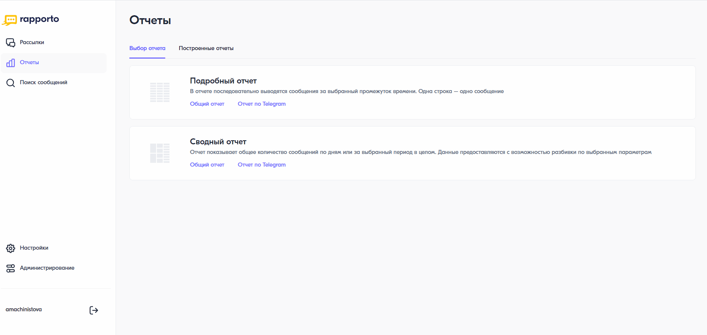

Подробный отчет
===========================

В подробном отчете последовательно выводятся сообщения за выбранный промежуток времени. Одна строка — одно сообщение.

Для построения подробного отчета необходимо выполнить следующее:
 
1. В личном кабинете перейти в раздел **“Отчеты”**, нажав на соответствующую иконку в левом меню страницы.

2. На открывшейся странице выбрать **“Подробный отчет”** — **“Общий отчет”**.
 
3. В блоке **“Период отчета”** выбрать период, за который необходимо построить отчет. Возможные значения:
 
   * Сегодня;

   * Вчера;

   * Неделя;

   * Текущий месяц;

   * Предыдущий месяц;

   * Вручную — указать произвольный период. Период не должен быть больше 6 месяцев от текущей даты.

4. В блоке **“Фильтры”** при необходимости выбрать фильтр по:
   
   * команде;
   * сервисному имени;
   * статусу;
   * оператору;
   * услуге.

5. В блоке **“Настройки таблицы”** установить необходимые параметры отображения отчета:

   * отображать сначала сообщения, отправленные раньше или позже;

   * выбрать колонки отчета. По умолчанию выбраны следующие — команда, дата и время, номер назначения, исходный номер, статус, тип сообщения, тип трафика. По мере добавления или удаления колонок пример отображения отчета будет меняться.

6. Выбрать формат файла, в котором будет скачан отчет — .csv или .xlsx.

7. При необходимости выбрать вариант разбивки отчета. Возможные значения:
   
   * Не разбивать файл (установлено по умолчанию);
   * Разбить на файлы по 1 млн. строк;
   * Разбить на файлы по 500 тыс. строк;
   * Разбить на файлы по 200 тыс. строк.
   
8. Нажать на кнопку **<Построить отчет>**. Начнется формирование отчета.

Сформированный отчет можно скачать на вкладке **“Построенные отчеты”**.

.. note:: В списке построенных отчетов будут видны только те отчеты, которые сформированы текущим пользователем, а не всеми участниками команды.

.. note:: Параметры и фильтры, настроенные при первом построении отчета, сохраняются при следующих попытках. При необходимости их можно изменить.
 
Описание причин недоставки сообщений разных типов приведено на странице :ref:`Описание кодов ошибок <REST-ErrCodeDescr>`.

