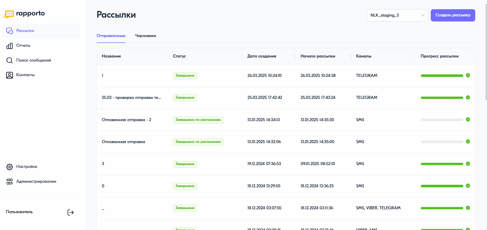

Добавление контактов
===========================

В личном кабинете Rapporto есть возможность загрузить список контактов, а затем использовать этот список в любой рассылке.

Для добавления контактов необходимо следующее:
 
1. В личном кабинете перейти в раздел **“Контакты”**, нажав на соответствующую иконку в левом меню страницы.

2. На открывшейся вкладке **“Список контактов”** нажать на кнопку **<Добавить>** в правом верхнем углу.
 
3. Выбрать способ добавления — один номер телефона или загрузка из файла:

.. tabs::

   .. tab:: добавление одного контакта

      * в открывшейся форме указать номер телефона абонента;
      * в блоке **“Сегменты”** добавить сегмент, к которому будет относится контакт. Наименование сегмента может быть любым;
      * нажать на кнопку **<Добавить>**.
  

   .. tab:: загрузка файла

      * в открывшейся форме нажать на область загрузки и выбрать файл в формате .csv, .txt или .xlsx. После загрузки будет указано количество новых контактов, уже существующих в системе и, в случае наличия, количество контактов с ошибочными данными и дубликаты;
      * в блоке **“Сегменты”** добавить сегмент, к которому будет относится контакт. Наименование сегмента может быть любым;
      * нажать на кнопку **<Добавить>**.

.. note:: В личном кабинете реализована возможность объединять отдельные контакты и списки контактов в сегменты, а затем использовать их в любой рассылке. Посмотреть список созданных сегментов можно на вкладке **“Сегменты”**.

В результате добавленные номера будут отображаться в списке контактов.
 
