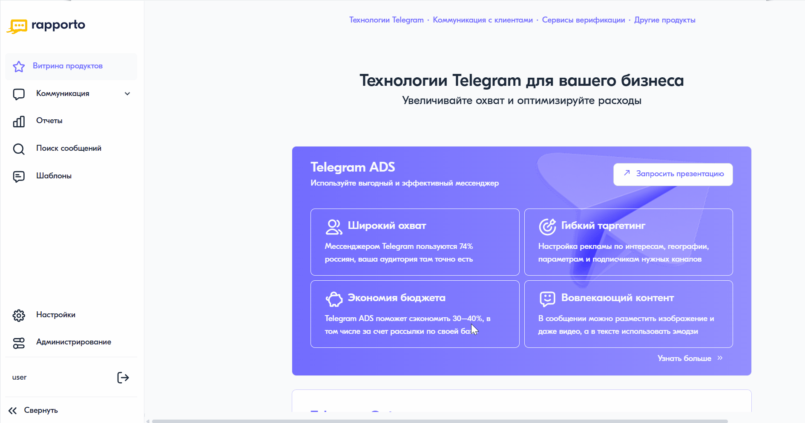

Добавление черновиков
======================

Для добавления нового черновика необходимо выполнить следующие действия:

1. В личном кабинете перейти в раздел **"Черновики"**, нажав на соответствующий пункт в левом меню.
2. В открывшемся разделе нажать на кнопку **<Создать черновик>**.
3. В поле **"Название"** ввести название черновика. Максимально допустимое количество символов — 180.
4. В поле **"Канал"** выбрать тип сообщения.
5. В поле **"Текст сообщения"** ввести текст сообщения. Счетчик под формой ввода текста отображает количество оставшихся и введенных символов в одной части сообщения, а также количество частей. На панели инструментов доступны кнопки для автоматического форматирования текста:

   * **<Транслитерировать>** — преобразует кириллицу в латиницу;

   * **<Удалить лишние пробелы>** — заменяет двойные пробелы одинарными.

6. Нажать на кнопку **<Сохранить>** для сохранения текста черновика.
