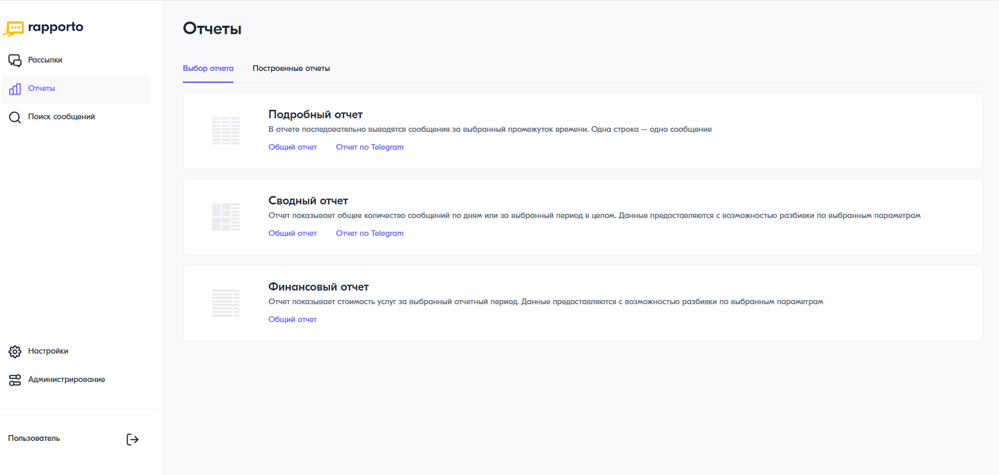

Финансовый отчет
=====================

Отчет показывает стоимость услуг за выбранный отчетный период. Данные предоставляются с возможностью разбивки по выбранным параметрам.

Для построения финансового отчета необходимо выполнить следующее:
 
1. В личном кабинете перейти в раздел **“Отчеты”**, нажав на соответствующую иконку в левом меню страницы.

2. На открывшейся странице выбрать **“Финансовый отчет”** — **“Общий отчет”**.
 
3. В блоке **“Период отчета”** выбрать период, за который требуется построить отчет. Возможные значения:
 
   * Месяц;
   * Вручную — указать произвольный период. Он может быть только в рамках одного месяца.

4. В блоке **“Тип разбивки”** выбрать необходимый вариант разбивки отчета. Возможные значения:

   * Сводный — выводит общее количество отправленных сообщений со всех сервисных имен в детализации по операторам сотовой связи с учетом ценовых диапазонов;
   * Команда — отображает количество отправленных сообщений по каждой команде в отдельности в детализации по операторам сотовой связи с учетом ценового диапазона;
   * Сервисное имя — выводит количество отправленных сообщений с каждого сервисного номера (имени) в детализации по операторам сотовой связи с учетом типа трафика;
   * Тарифная опция — отображает количество отправленных сообщений определенного типа трафика в рамках каждого оператора сотовой связи с детализацией сервисных номеров (имен);
   * Услуга — выводит количество отправленных сообщений в рамках отдельных услуг по подключениям.
  
  Дополнительно указать, нужно ли сделать разбивку данных или суммы по дням.

5. При необходимости выбрать дополнительные опции: включать в отчет абонентскую плату или комиссии и скидки. Возможно использовать оба параметра.

6. В блоке **“Производить расчет по средней цене для”** отметить, для каких операторов необходимо выполнить расчет по средней цене.

7. В блоке **“Фильтры”** при необходимости выбрать фильтр по команде, услуге или каналу.

8. Нажать на кнопку **<Построить отчет>**. Начнется формирование отчета.

Если данных нет, появляется уведомление “За выбранный период нет данных”. В этом случае необходимо выбрать другой период отчета или изменить фильтры.

При добавлении или измении параметров настройки для обновления отчета необходимо также нажать на кнопку **<Построить отчет>**.

.. note:: Параметры и фильтры, настроенные при первом построении отчета, сохраняются при следующих попытках. При необходимости их можно изменить.

| Для скачивания отчета следует нажать на кнопку **<Скачать отчет>**.
| Чтобы скрыть настройки, необходимо нажать на “крестик” в блоке настроек. Чтобы показать их, нужно нажать на кнопку **<Показать настройки>**.

 
