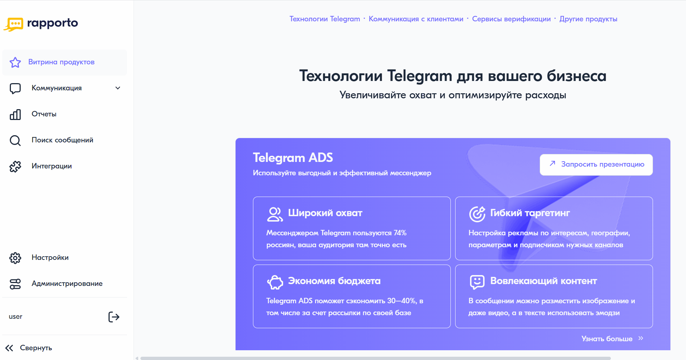

Информация об интеграционных подключениях
==========================================

Для просмотра сведений об интеграционных подключениях необходимо выполнить следующее:

1. В личном кабинете в левом меню выбрать пункт **"Интеграции"**.

2. В открывшемся разделе по включенным командам отобразятся доступные интеграционные подключения и их основные параметры: 
  
+---------------------------------------------+-------------------------------------------------------------------------------------------------------------+
| Наименование параметра                      | Описание                                                                                                    |
+=============================================+=============================================================================================================+
| Название                                    | Наименование интеграционного подключения.                                                                   |
+---------------------------------------------+-------------------------------------------------------------------------------------------------------------+
| Тип                                         | Тип протокола интеграции. Возможные значения:                                                               |
|                                             |                                                                                                             |
|                                             | * ``REST``;                                                                                                 |
|                                             | * ``REST_BATCH``;                                                                                           |
|                                             | * ``HTTP``;                                                                                                 |
|                                             | * ``ADVANCED_SMPP``.                                                                                        |
+---------------------------------------------+-------------------------------------------------------------------------------------------------------------+
| Статус                                      | Текущее состояние интеграции. Возможные значения:                                                           |
|                                             |                                                                                                             |
|                                             | * ``Включена``;                                                                                             |
|                                             | * ``Выключена``.                                                                                            |
+---------------------------------------------+-------------------------------------------------------------------------------------------------------------+
| Количество соединений                       | Допустимое число соединений. Соответствует параметру "Максимальное количество открытых соединений"          |
|                                             | в детальной информации об интеграционном подключении.                                                       |
+---------------------------------------------+-------------------------------------------------------------------------------------------------------------+
| Текущий лимит, части                        | Текущий остаток количества частей сообщений от максимального лимита. Соответствует параметру                |          
|                                             | "Текущее значение лимита" в детальной информации об интеграционном подключении.                             |
+---------------------------------------------+-------------------------------------------------------------------------------------------------------------+
| Максимальный лимит, части/период обновления | Максимально допустимое количество частей сообщений. Опционально период обновления может быть ежедневным,    |
|                                             | еженедельным, ежемесячным, ежеминутным, ежечасным.                                                          |
+---------------------------------------------+-------------------------------------------------------------------------------------------------------------+
| Команда                                     | Наименование команды, к которой относится интеграционное подключение.                                       |
+---------------------------------------------+-------------------------------------------------------------------------------------------------------------+

3. При нажатии на интеграционное подключение в правой части окна отобразится детальная информация о выбранном подключении: 

+---------------------------------------------+---------------------------------------------------------------------------------------------------------------------------+
| Наименование параметра                      | Описание                                                                                                                  |
+=============================================+===========================================================================================================================+
| Команда                                     | Наименование команды, к которой относится интеграционное подключение.                                                     |
+---------------------------------------------+---------------------------------------------------------------------------------------------------------------------------+
| Логин                                       | Логин для доступа к интеграционному подключению.                                                                          |
+---------------------------------------------+---------------------------------------------------------------------------------------------------------------------------+
| Пароль                                      | Пароль для доступа к интеграционному подключению.                                                                         |          
+---------------------------------------------+---------------------------------------------------------------------------------------------------------------------------+
| Шаблоны IP-адресов                          | Список IP-адресов или масок IP-адресов.                                                                                   |
+---------------------------------------------+---------------------------------------------------------------------------------------------------------------------------+
| Максимальное количество открытых соединений | Предельно допустимое число соединений. Соответствует параметру "Количество соединений" в разделе основных параметров.     |
+---------------------------------------------+---------------------------------------------------------------------------------------------------------------------------+
| Услуга                                      | Идентификатор услуги.                                                                                                     |
+---------------------------------------------+---------------------------------------------------------------------------------------------------------------------------+
| Отчеты о статусах сообщений                 | Определяет необходимость отчетов о статусах сообщений. Возможные значения:                                                |
|                                             |                                                                                                                           |
|                                             | * ``Статусы не нужны``;                                                                                                   |
|                                             | * ``Все статусы``;                                                                                                        |
|                                             | * ``Только статус "Не доставлено"``.                                                                                      |                                            
+---------------------------------------------+---------------------------------------------------------------------------------------------------------------------------+
| Текущее значение лимита                     | Текущий остаток количества частей сообщений от максимального лимита. Соответствует параметру "Текущий лимит, части"       |
|                                             | в разделе основных параметров.                                                                                            |
+---------------------------------------------+---------------------------------------------------------------------------------------------------------------------------+
| Максимальное значение лимита                | Максимально допустимое количество частей сообщений. Соответствует параметру "Максимальный лимит, части"                   |
|                                             | в разделе основных параметров.                                                                                            |
+---------------------------------------------+---------------------------------------------------------------------------------------------------------------------------+
| Разрешенные сервисные имена                 | Список сервисных имен, доступных для интеграционного подключения.                                                         |          
+---------------------------------------------+---------------------------------------------------------------------------------------------------------------------------+
| Адрес сервлета для приема запросов          | Относительный путь к сервлету, обрабатывающему входящие запросы.                                                          |
+---------------------------------------------+---------------------------------------------------------------------------------------------------------------------------+
| URL для передачи статусов доставки          | URL для приема уведомлений о статусах доставки.                                                                           |
+---------------------------------------------+---------------------------------------------------------------------------------------------------------------------------+

