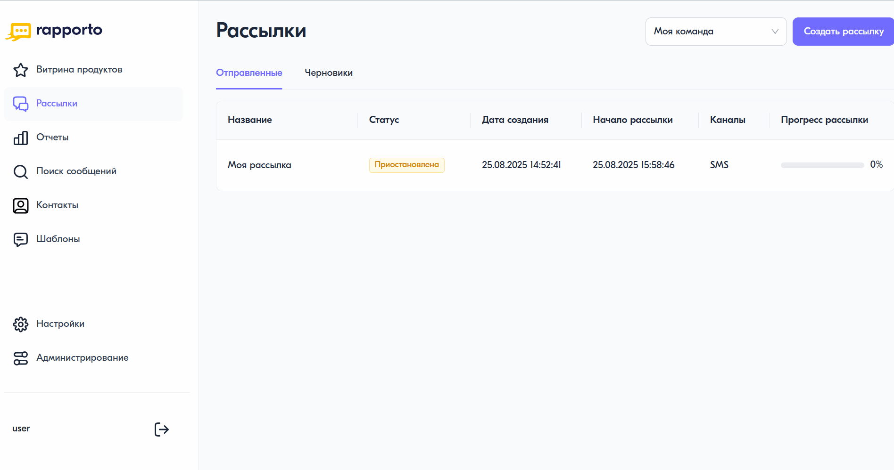

Редактирование рассылок
=========================

Параметры запущенных рассылок могут быть изменены до момента их планового или принудительного завершения.

Для редактирования свойств текущей рассылки необходимо выполнить следующие действия:

1. В личном кабинете в разделе **"Рассылки"** на вкладке **"Отправленные"** выбрать соответствующую рассылку в списке.
2. На странице рассылки в блоке **"Параметры"** нажать на кнопку **<Редактировать>**.
3. На панели настроек:

   * (только для запланированных рассылок) в блоке **"Отложенная отправка"** изменить параметры :doc:`отложенной отправки <delayed_sender>`;

   * в блоке **"Указать дату окончания"** установить дату и время :doc:`окончания рассылки <date_of_end>`;

   * в блоке **"Установить расписание"** настроить :doc:`расписание рассылки <schedule>`.

4. По завершении редактирования параметров рассылки нажать на кнопку **<Сохранить>** в правом нижнем углу панели настроек для применения изменений.
