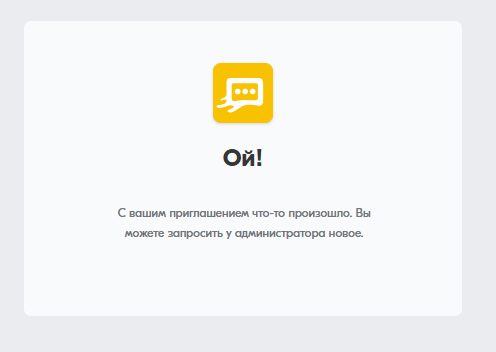
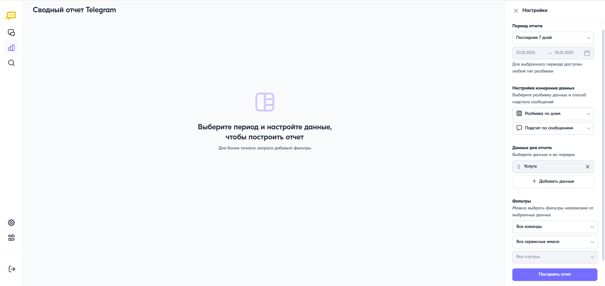
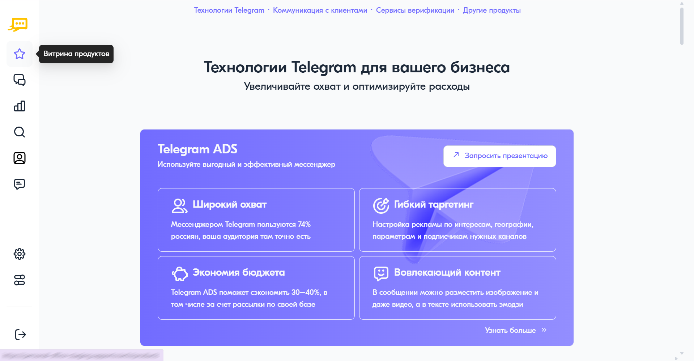

Часто задаваемые вопросы
===========================

**Обновленный личный кабинет: быстрее, удобнее, функциональнее!**

Мы переводим пользователей на новый личный кабинет. Он современнее и эффективнее.

Вот ключевые улучшения:

* Интуитивный интерфейс — теперь всё на своих местах. Понятная навигация, удобное управление рассылками и отчетами.

* Современный дизайн — приятный внешний вид без устаревших элементов. Работать станет комфортнее.

* Высокая скорость работы — страницы загружаются быстрее, сводные отчеты формируются мгновенно, а финансовый и подробный — быстрее, чем в предыдущей версии личного кабинета.

* Гибкость и контроль — новые возможности по управлению правами и ролями в компании. Теперь вы можете сами управлять учетными записями в рамках своей компании и управлять доступами пользователей к различному функционалу.

Мы уверены, что новый кабинет сделает вашу работу ещё удобнее.

На этой странице мы постарались ответить на возможные вопросы, которые могут возникнуть у вас при переходе со старого кабинета на новый.

------

**1. Смогу ли я пользоваться старым кабинетом?**

Да, некоторое время вы сможете пользоваться старым личным кабинетом, однако его поддержка будет прекращена, а доступ к нему будет закрыт. Мы сообщим о дате закрытия отдельным уведомлением.

--------

**2. Я получил письмо "Завершите регистрацию", но перейдя по ссылке вижу текст "С вашим приглашением что-то произошло. Вы можете запросить у администратора новое". Что делать?**

Письмо со ссылкой для завершения регистрации в новом личном кабинете имеет ограниченный срок действия ссылки. Скорее всего, ваша ссылка истекла. Обратитесь в `техническую поддержку <https://doc.rapporto.ru/support.html>`_ для получения новой ссылки или обратитесь к другому пользователю с правами администратора в вашем личном кабинете, если он есть.

----------

**3. Буду ли я видеть рассылки из старого кабинета?**

Все сообщения из рассылок по-прежнему будут отображаться в сводном, подробном и финансовом отчетах. Однако в разделе "Рассылки" нового личного кабинета будут отображаться только новые рассылки. Рассылки из старого кабинета перенести невозможно.

-------

**4. В старом кабинете было много видов отчетов, а в новом всего 3. Где мне найти старые отчеты?**

* **Сводный отчет.** 
  Все виды сводных отчетов теперь объединены в один универсальный "Сводный отчет", который позволяет анализировать данные в любых разрезах. Инструкцию по исползованию можно посмотреть в статье :doc:`summary_report`.
  
.. note:: Разбивки по странам и регионам будут добавлены в следующих обновлениях (ориентировочно апрель–июнь 2025 года).

* **Подробный отчет.**
  Хронологический отчет практически не изменился, но добавлены новые поля и фильтры. Инструкцию по использованию можно посмотреть в статье :doc:`chron_report`.
  
.. note:: В следующих релизах появится возможность просматривать подробный отчет прямо в приложении без скачивания (апрель–июнь 2025 года).

* **Финансовый отчет.**
  :doc:`financial_report` из раздела "Тарифная информация" перенесен в раздел "Отчеты".

------------

**5. Где тарифная информация? Я хочу посмотреть текущие цены на трафик.**

Функционал просмотра тарифной информации появится в ближайших релизах (ориентировочно июль–сентябрь 2025 года). За уточнением информации по тарифам вы можете обратиться к своему персональному менеджеру.

----------

**6. Рассылка, которую я пытаюсь запустить, завершается со статусом "Прервана". Что делать?**

Это могло произойти из за технической ошибки при переводе из старого личного кабинета в новый. Обратитесь в `службу технической поддержки <https://doc.rapporto.ru/support.html>`_.

-------------

**7. Я нажимаю на кнопку "Построить отчет", но он не строится. Вижу надпись "Выберите период и настройте данные, чтобы построить отчет. Для более точного запроса добавьте фильтры" или "При построении отчета возникла ошибка". Что делать?**

Это могло произойти из за технической ошибки при переводе из старого личного кабинета в новый или при заведении учетных данных. Обратитесь в `службу технической поддержки <https://doc.rapporto.ru/support.html>`_.

-------------

**8. Где я могу ознакомиться с продуктами компании "Раппорто" и получить дополнительную информацию о них?**

В личном кабинете доступен специальный раздел меню – **Витрина продуктов** – с кратким описанием продуктов и услуг, их преимуществ и особенностей подключения:

Для получения подробной информации о конкретном продукте или услуге нажмите на кнопку **<Запросить презентацию>**.
