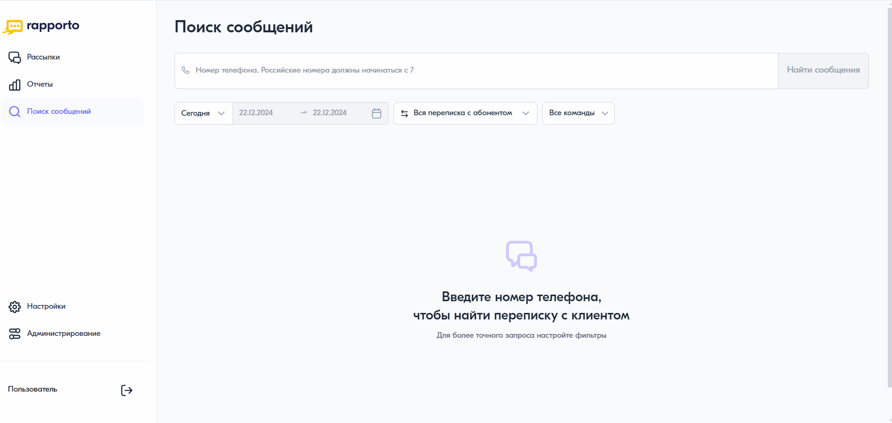

Настройка прав пользователю
===========================

После добавления пользователя в личный кабинет он отображается в разделе **“Администрирование”** на вкладке **“Пользователи”**. В списке пользователей отображается его имя, email и статус.

Возможные значения статуса:

* “Отправлено приглашение” — пользователю на email отправлено приглашение для регистрации в личном кабинете;

* “Активный” — пользователь принял приглашение и завершил регистрацию в личном кабинете. При необходимости его можно заблокировать, тем самым ограничить доступ в личный кабинет;

* “Ошибка отправки приглашения” — по техническим причинам произошла ошибка отправки приглашения. В этом случае можно повторить отправку или удалить пользователя;

* “Срок приглашения закончился” — пользователь не успел перейти по ссылке из приглашения и срок его действия истек. При необходимости можно отправить новое приглашение или удалить пользователя;

* “Заблокирован” — пользователь заблокирован и не имеет доступа в личный кабинет. При необходимости его можно разблокировать.

Как только пользователю отправлено приглашение или он уже перешел в статус “Активный”, ему можно настроить права. 

Для этого необходимо выполнить следующее:

1. На вкладке **“Пользователи”** нажать на имя нужного пользователя.

2. На открывшейся странице в блоке **“Общие права доступа”** настроить необходимые права:

   * включить функцию **“Настройки входа по IP”**, чтобы разрешить доступ в личный кабинет с определенных IP-адресов. Для добавления нажать **“Редактировать”**, в поле ввести IP-адрес в формате IPv4 и нажать на кнопку **<Добавить>**. Количество добавляемых IP-адресов не ограничено, можно указывать диапазон или вводить по одному;
   
   * включить переключатель **“Настройки”**, чтобы активировать раздел “Настройки” в левом меню страницы;

   * активировать функцию **“Администрирование”**, чтобы пользователь мог добавлять других пользователей и управлять всеми настройками.

3. В блоке **“Безопасность данных”** при необходимости настроить возможность:

   * просмотра скрытых данных — пользователь сможет видеть в сообщениях всю скрытую звездочками информацию, включая коды безопасности;
   
   * просмотра номеров телефонов — пользователь сможет видеть номера телефонов без маскировки в подробном отчете.

4. Следом за безопасностью данных будет указана команда или команды, в которые включен пользователь. Каждой команде соответствуют определенные права. Для активации необходимо включить переключатель напротив нужной команды и установить требуемые права. Подробнее о командах в статье :doc:`teams`.

