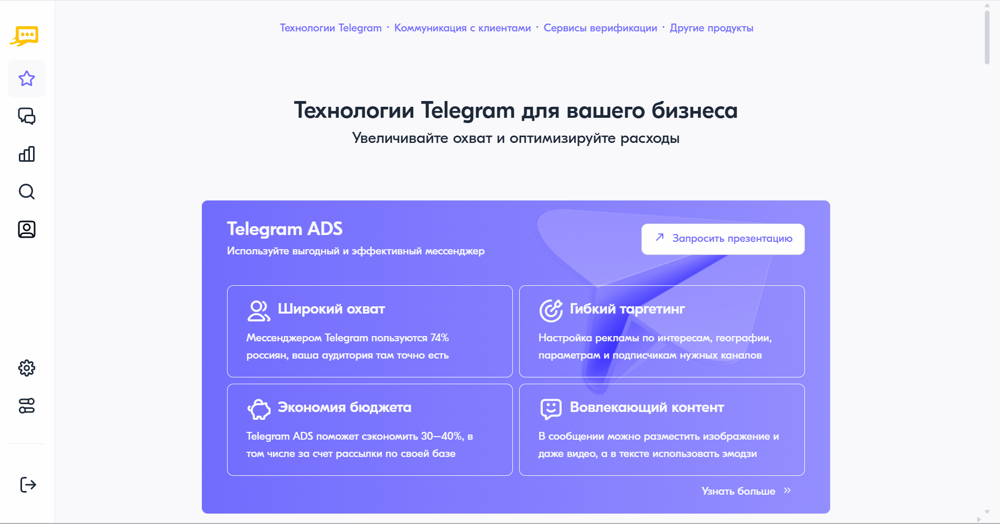

Настройка прав пользователя
============================

Все пользователи личного кабинета добавляются в общий список, представленный на вкладке **"Пользователи"** раздела **"Администрирование"**. В списке представлена информация об имени, адресе электронной почты и статусе пользователя. Администраторы могут изменять права пользователя вне зависимости от его :ref:`статуса <user-status>`.

Для редактирования прав пользователя необходимо выполнить следующие действия:

1. Выбрать соответствующего пользователя в общем списке.

2. На открывшейся странице в правом верхнем углу нажать на кнопку **<Редактировать>**.

3. В блоке **"Общие права доступа"** настроить следующие права:

   * **"Вход по IP"** — при включении пользователь сможет получить доступ в личный кабинет только с определенных IP-адресов. IP-адреса указываются в формате IPv4 по одному в каждом поле. Для отображения дополнительного поля необходимо нажать на область **<Добавить еще один IP>**. Количество добавляемых IP-адресов не ограничено, можно указывать диапазон или вводить по одному;

   * **"Двухфакторная аутентификация"** — при включении пользователю потребуется вводить одноразовый код из сообщения при каждой попытке входа в личный кабинет.

   * **"Настройки пользователя"** — при включении пользователь сможет просматривать данные своего профиля через раздел **"Настройки"** в левом меню страницы и изменять пароль;
   
   * **"Администрирование компанией"** — при включении пользователь сможет управлять другими пользователями и изменять их настройки.

4. В блоке **"Безопасность данных"** настроить доступ к чувствительным данным:

   * **"Просмотр скрытых данных"** — при включении пользователь получит доступ ко всей скрытой по умолчанию информации в сообщениях, включая коды безопасности;
   
   * **"Просмотр номеров телефонов"** — при включении пользователь получит доступ к номерам телефонов абонентов в подробном отчете.

5. Остальные блоки настроек пользователя относятся к командам. Для включения пользователя в команду необходимо перевести соответствующий переключатель в активное положение, после чего определить права пользователя в пределах выбранной команды. Подробнее о командах в статье :doc:`teams`.

6. По завершении настройки прав пользователя необходимо нажать на кнопку **<Сохранить>** в правом верхнем углу для выхода из режима редактирования и применения внесенных изменений.

.. _user-status:

Статусы пользователей
------------------------

Возможные значения статуса:

* "Отправлено приглашение" — пользователю отправлено приглашение для регистрации в личном кабинете;

* "Активный" — пользователь принял приглашение и завершил регистрацию в личном кабинете. При необходимости пользователя можно заблокировать, ограничив ему доступ в личный кабинет;

* "Ошибка отправки приглашения" — по техническим причинам произошла ошибка отправки приглашения. При необходимости можно повторно отправить приглашение или удалить пользователя;

* "Срок приглашения закончился" — пользователь не успел перейти по ссылке из приглашения в пределах срока его действия. При необходимости можно отправить новое приглашение или удалить пользователя;

* "Заблокирован" — пользователь заблокирован и не имеет доступа в личный кабинет. При необходимости его можно разблокировать.
