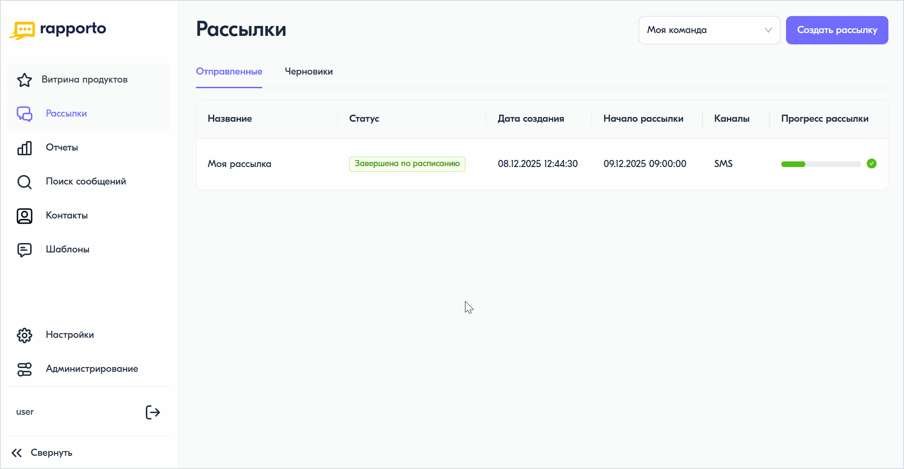

Создание SMS-рассылки
========================

Для создания SMS-рассылки необходимо выполнить следующие действия:
 
1. В личном кабинете перейти в раздел **"Рассылки"**, выбрав соответствующий пункт в левом меню.

2. В открывшемся разделе в правом верхнем углу нажать на кнопку **<Создать рассылку>**.
 
3. В поле **"Название рассылки"** ввести название рассылки. Максимально допустимое количество символов — 180.
 
4. В блоке **"Параметры рассылки"** указать значения необходимых параметров: отложенная отправка, дата окончания или расписание рассылки (включено по умолчанию). Подробнее о данных параметрах в статьях:
 
   * :doc:`delayed_sender`;

   * :doc:`date_of_end`;

   * :doc:`schedule`.

.. note:: 
   
   Если указанные параметры рассылки противоречат друг другу (например, дата и время старта отложенной отправки раньше даты, указанной в расписании), система временно заблокирует запуск рассылки и выведет предупреждение о необходимости корректировки параметров.

5. В блоке **"Получатели"** добавить список контактов — загрузить файл с номерами телефонов, указать их вручную или выбрать из сегментов. 

.. tabs::

   .. tab:: Загрузка файла
      
      Для добавления файла необходимо нажать на область для загрузки и выбрать предварительно подготовленный файл со списком контактов (см. :doc:`file_sender`). 
      
      
   .. tab:: Добавление вручную

      Для добавления номеров вручную необходимо перейти на вкладку **"Вручную"** и ввести номера телефонов через запятую, точку с запятой или каждый с новой строки. Для абонентов РФ номер телефона должен состоять из 11 цифр и начинаться с цифры 7, например, 79990002233. 
      
      
   .. tab:: Выбор сегмента

      Для использования номеров телефонов из сегментов необходимо перейти на вкладку **"Из сегментов"** и выбрать один или несколько сегментов в списке. Для поиска определенных сегментов доступно соответствующее поле.
         
   Статус обработки контактов, а также информация о валидных и невалидных номерах будут отображены под формой предпросмотра текста сообщения.
 
6. Добавить канал рассылки — SMS. 
 
7. В открывшейся форме:
 
   * в поле **"Имя отправителя"** выбрать сервисное имя (подпись), которое вы используете для рассылок;

   * в поле **"Текст сообщения"** ввести текст сообщения. Счетчик под формой ввода текста отображает количество оставшихся и введенных символов в одной части SMS-сообщения, а также количество частей. Пример сообщения будет отображен в форме предпросмотра текста, расположенной справа.
     На панели инструментов доступны следующие кнопки для работы с текстом сообщения:
   
     +--------------------------+-------------------------------------------------------------+
     | Наименование кнопки      | Описание                                                    |
     +==========================+=============================================================+
     | Включить транслитерацию  | Преобразует кириллицу в латиницу.                           |
     +--------------------------+-------------------------------------------------------------+
     | Удалить лишние пробелы   | Заменяет двойные пробелы одинарными.                        |
     +--------------------------+-------------------------------------------------------------+
     | Добавить подстановку     | Добавляет ранее загруженные переменные данные. См. статью   |
     |                          | :doc:`substitutions`.                                       |
     +--------------------------+-------------------------------------------------------------+
     | Добавить черновик        | Подставляет текст из выбранного черновика. См. статью       |
     |                          | :doc:`../lk/drafts/drafts_intro`.                           |
     +--------------------------+-------------------------------------------------------------+

     Чекбокс **"Сохранить как переиспользуемый черновик"** позволяет сохранить текущий текст сообщения как черновик для последующего использования.

     После успешного добавления контактов и ввода текста сообщения под формой предпросмотра отобразится информация об общем количестве частей и предварительной стоимости рассылки. Предварительная стоимость рассчитывается только при загрузке контактов из файла или при ручном вводе.

8. Установить время жизни сообщения, максимальное значение — 48 часов.
   
9.  Нажать на кнопку запуска рассылки в правом верхнем углу.

