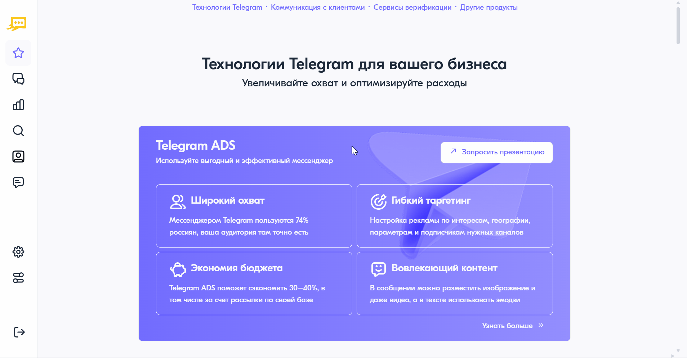

Сводный отчет Telegram
========================

Сводный отчет Telegram показывает общее количество Telegram-сообщений по дням или за выбранный период. Данные предоставляются с возможностью разбивки по выбранным параметрам настройки.

Для построения сводного отчета Telegram необходимо выполнить следующие действия:

1. В личном кабинете перейти в раздел **"Отчеты"**, нажав на соответствующую иконку в левом меню страницы.

2. На открывшейся странице выбрать **"Сводный отчет"** — **"Отчет по Telegram"**.

3. На панели настроек выбрать команду, по которой необходимо построить отчет.
 
4. Выбрать требуемый период отчета. Возможные значения:
 
   * Сегодня;
   * Вчера;
   * Последние 7 дней;
   * Предыдущий месяц;
   * Текущий месяц;
   * Вручную — указать произвольный период.

5. В настройках измерения данных выбрать вариант их разбивки. Возможные значения:

   * Разбивка по дням — для периода не более 31 дня;
   * Разбивка по неделям — для периода не более года;
   * Разбивка по месяцам;
   * Разбивка по годам;
   * Итог за выбранный период.

6. Выбрать способ подсчета сообщений. Возможные значения:

   * Подсчет по сообщениям;
   * Подсчет по просмотрам;
   * Подсчет по переходам;
   * Все способы подсчета.

7. В блоке **"Данные для отчета"** выбрать данные, которые будут отображаться в отчете. По умолчанию выбраны: услуга, направление и статус. Для добавления нового параметра следует нажать на кнопку **<+ Добавить данные>**. Полный список возможных значений:

   * Услуга;
   * Направление;
   * Статус;
   * Команда;
   * Партнер;
   * Сервисное имя.

   .. note::

      Для изменения порядка параметров необходимо переместить соответствующие элементы за левый край на новые позиции.

8. В блоке **"Фильтры"** при необходимости выбрать фильтр по команде, сервисному имени или статусу сообщений.

9. Нажать на кнопку **<Построить отчет>**.

.. note::
   
   Параметры и фильтры, настроенные при первом построении отчета, сохраняются при следующих попытках. При необходимости их можно изменить.

При отсутствии данных отобразится уведомление **"За выбранный период нет данных"**. В этом случае необходимо выбрать другой период отчета или изменить фильтры.

При каждом добавлении или изменении параметров настройки необходимо нажать на кнопку **<Построить отчет>** для обновления отчета.

Для скрытия панели настроек необходимо нажать на соответствующую кнопку в левом верхнем углу панели. Для восстановления панели настроек необходимо нажать на кнопку **<Показать настройки>** в правом верхнем углу страницы.

Для скачивания отчета следует нажать на кнопку **<Скачать отчет>**. Возможна выгрузка отчета в файл формата .csv и .xlsx.

Описание причин недоставки сообщений разных типов приведено на странице :ref:`Описание кодов ошибок <REST-ErrCodeDescr>`.
