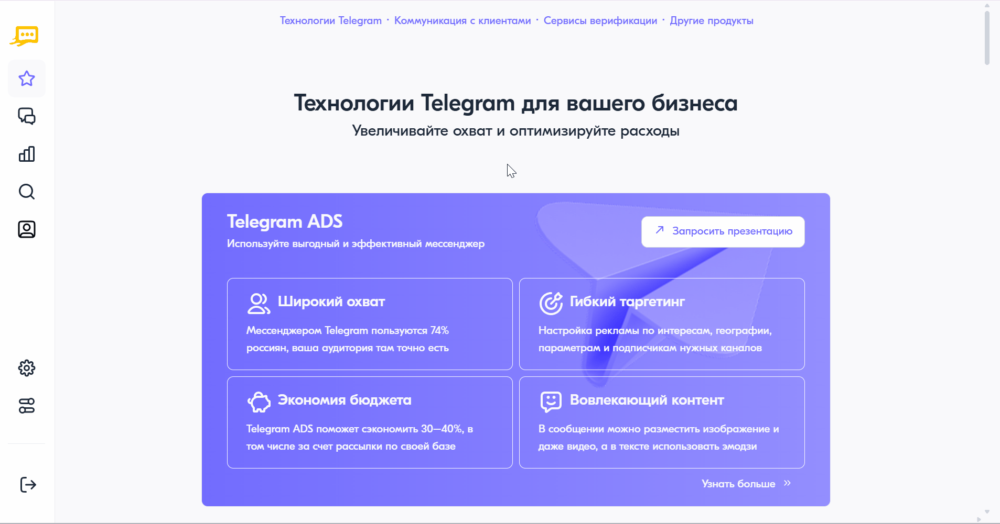

Сводный отчет
===================

Сводный отчет показывает общее количество сообщений по дням или за выбранный период. Данные предоставляются с возможностью разбивки по выбранным параметрам настройки.

Для построения подробного отчета необходимо выполнить следующие действия:

 
1. В личном кабинете перейти в раздел **"Отчеты"**, нажав на соответствующую иконку в левом меню страницы.

2. На открывшейся странице выбрать **"Сводный отчет"** — **"Общий отчет"**.
 
3. В блоке настроек выбрать команду, по которой необходимо построить отчет.

4. Выбрать требуемый период отчета. Возможные значения:
 
   * Сегодня;
   * Вчера;
   * Последние 7 дней;
   * Предыдущий месяц;
   * Текущий месяц;
   * Вручную — указать произвольный период.

5. В настройках измерения данных выбрать вариант их разбивки. Возможные значения:

   * Разбивка по дням — для периода не более 31 дня;
   * Разбивка по неделям — для периода не более года;
   * Разбивка по месяцам;
   * Разбивка по годам;
   * Итог за выбранный период.

6. Указать, какие сообщения включать в отчет: отправленные абоненту, полученные от абонента или всю переписку с абонентом.

7. Выбрать способ подсчета сообщений. Возможные значения:

   * Подсчет по частям;
   * Подсчет по сообщениям;
   * Подсчет по сообщениям и частям.

8. В блоке **"Данные для отчета"** выбрать данные, которые будут отображаться в отчете. Для добавления нового параметра следует нажать на кнопку **<+ Добавить данные>**. Возможные значения:

   * Команда;
   * Тип сообщения;
   * Вид трафика;
   * Тип трафика;
   * Партнер;
   * Сервисное имя;
   * Услуга;
   * Направление;
   * Статус;
   * Текст шаблона;
   * Страна;
   * Регион.

   .. note::

      Для изменения порядка параметров необходимо переместить соответствующие элементы за левый край на новые позиции.

9. В блоке **"Фильтры"** при необходимости выбрать фильтр по сервисному имени или статусу сообщений.

10.  Нажать на кнопку **<Построить отчет>**.

.. note::
   
   Параметры и фильтры, настроенные при первом построении отчета, сохраняются при следующих попытках. При необходимости их можно изменить.

При отсутствии данных отобразится уведомление **"За выбранный период нет данных"**. В этом случае необходимо выбрать другой период отчета или изменить фильтры.

При каждом добавлении или изменении параметров настройки необходимо нажать на кнопку **<Построить отчет>** для обновления отчета.

Для скачивания отчета следует нажать на кнопку **<Скачать отчет>**. Возможна выгрузка отчета в файл формата .csv и .xlsx.

Для скрытия блока настроек необходимо нажать на "крестик". Для отображения соответствующего блока необходимо нажать на кнопку **<Показать настройки>**.

Описание причин недоставки сообщений разных типов приведено на странице :ref:`Описание кодов ошибок <REST-ErrCodeDescr>`.
