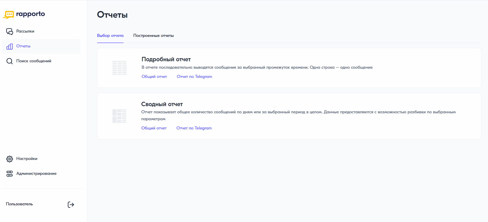

Сводный отчет
===================

Сводный отчет показывает общее количество сообщений по дням или за выбранный период. Данные предоставляются с возможностью разбивки по выбранным параметрам настройки.

Для построения сводного отчета необходимо выполнить следующее:
 
1. В личном кабинете перейти в раздел **“Отчеты”**, нажав на соответствующую иконку в левом меню страницы.

2. На открывшейся странице выбрать **“Сводный отчет”** — **“Общий отчет”**.
 
3. В блоке настроек выбрать требуемый период отчета. Возможные значения:
 
   * Сегодня;

   * Вчера;

   * Последние 7 дней;

   * Предыдущий месяц;

   * Текущий месяц;

   * Вручную — указать произвольный период.

4. В настройках измерения данных выбрать вариант их разбивки. Возможные значения:

   * Разбивка по дням — для периода не более 31 дня;

   * Разбивка по неделям — для периода не более года;

   * Разбивка по месяцам;

   * Разбивка по годам;

   * Итог за выбранный период.

5. Указать, какие сообщения включать в отчет: отправленные абоненту, полученные от абонента или всю переписку с абонентом.

6. Выбрать способ подсчета сообщений. Возможные значения:

   * Подсчет по частям;

   * Подсчет по сообщениям;

   * Подсчет по сообщениям и частям.

7. В блоке **“Данные для отчета”** выбрать данные, которые будут отображаться в отчете. По умолчанию отображаются статус сообщения, наименование направления и наименование услуги. Чтобы добавить новый параметр, нужно нажать на кнопку **<+ Добавить данные>**. При необходимости можно изменить их порядок, потянув за левый край строки нужного параметра. Возможные значения:

   * Команда;
   
   * Тип сообщения;
   
   * Тип трафика;
   
   * Партнер;

   * Сервисное имя;

   * Текст шаблона.

8. В блоке **“Фильтры”** при необходимости выбрать фильтр по команде, сервисному имени или статусу сообщений.

9.  Нажать на кнопку **<Построить отчет>**.

.. note:: Параметры и фильтры, настроенные при первом построении отчета, сохраняются при следующих попытках. При необходимости их можно изменить.

Если данных нет, появляется уведомление **“За выбранный период нет данных”**. В этом случае необходимо выбрать другой период отчета или изменить фильтры.

При добавлении или измении параметров настройки для обновления отчета необходимо также нажать на кнопку **<Построить отчет>**.

Для скачивания отчета следует нажать на кнопку **<Скачать отчет>**. Возможна выгрузка отчета в формате .csv и .xlsx.

Чтобы скрыть настройки, необходимо нажать на “крестик” в блоке настроек. Чтобы показать их, нужно нажать на кнопку **<Показать настройки>**.

Описание причин недоставки сообщений разных типов приведено на странице :ref:`Описание кодов ошибок <REST-ErrCodeDescr2>`.