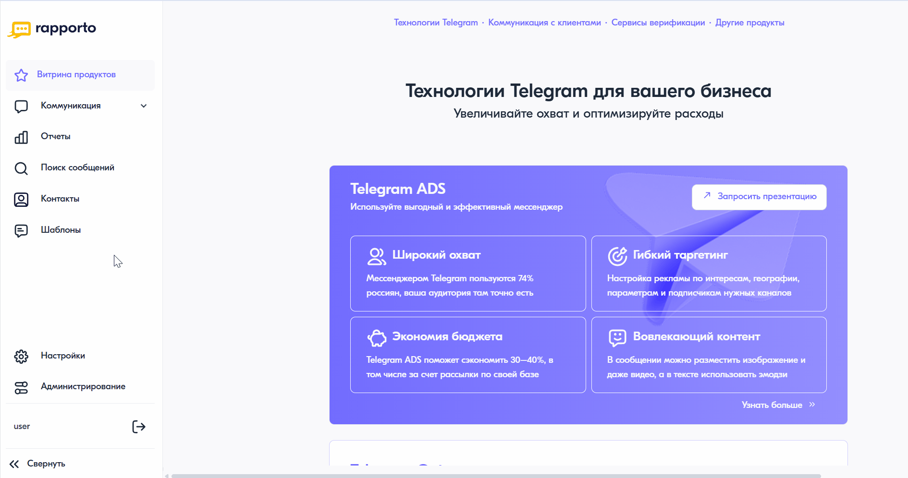

Добавление шаблонов
====================

Для добавления новых шаблонов необходимо выполнить следующие действия:

1. В личном кабинете перейти в раздел **"Шаблоны"**, нажав на соответствующий пункт в левом меню.
2. В открывшемся разделе в верхней части окна нажать на кнопку **<Загрузить из файла>**.
3. В форме регистрации шаблона на первом этапе **"Подготовка"** выполнить следующие шаги:
   
   * Шаг 1: выбрать из списка команду, за которой будут закреплены шаблоны.
   * Шаг 2: нажать на область загрузки файла и выбрать предварительно подготовленный :doc:`файл с шаблонами <templates_file>` в формате .xlsx или .csv. 

При успешной загрузке файла появится сообщение с указанием количества найденных в файле шаблонов. 

.. note::

   Блок **"Показать подсказку"** содержит краткое описание требований, предъявляемых к загружаемому шаблону, а также примеры оформления строк. Для сохранения файла с образцом на свой компьютер необходимо нажать на кнопку **<Скачать пример XLSX>** в левом нижнем углу. Рекомендуется использовать данный файл в качестве исходного для добавления собственных шаблонов.

4. В правом нижнем углу нажать на кнопку **<Отправить на проверку>** (на кнопке указано количество шаблонов в загруженном файле).
   
5. На втором этапе  **"Проверка и отправка на регистрацию"** файл будет автоматически проверен на соответствие предъявляемым требованиям. Шаблоны, прошедшие проверку, будут отправлены операторам сотовой связи для регистрации.

   .. note::

      Сроки регистрации определяются внутренними регламентами операторов сотовой связи. В некоторых случаях процесс может занимать до 14 дней.

7. На третьем этапе **"Результаты"** приводятся списки отправленных на регистрацию шаблонов и шаблонов с ошибками. Для того чтобы скачать шаблоны с ошибками, необходимо перейти на соответствующую вкладку и нажать на кнопку **"Скачать все шаблоны с ошибкой"**.
