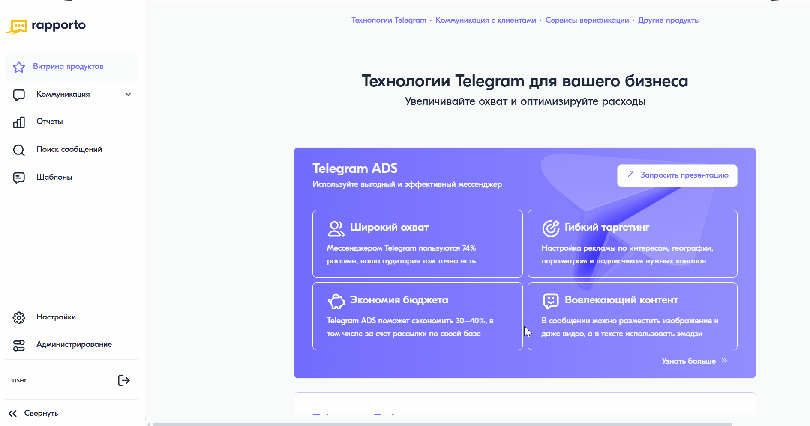

История загрузок шаблонов
==============================================

Для просмотра сведений о дате, времени и результате каждой загрузки файла с шаблонами необходимо выполнить следующие действия:

1. В разделе **"Шаблоны"** перейти на вкладку **"История загрузок"**.
   
   Новые события, которые пользователь еще не просмотрел, отмечаются красным маркером и сопровождаются информационным сообщением.
   К таким событиям относятся, в частности, ошибки, выявленные в процессе передачи шаблонов оператору сотовой связи для регистрации.

2. Нажать на наименование файла, чтобы увидеть детальную информацию по каждому отправленному шаблону в нем.

   Информация о шаблонах в выбранном файле представлена на двух вкладках:

   * **"Отправленные шаблоны"** — содержит перечень шаблонов, отправленных на регистрацию оператору сотовой связи. Срок регистрации шаблона оператором сотовой связи может занимать до 14 дней.

   * **"Шаблоны с ошибками"** — содержит шаблоны, которые не были отправлены на регистрацию оператору сотовой связи из-за ошибок, обнаруженных при загрузке файла или в процессе передачи оператору сотовой связи для регистрации. Подробное описание ошибки указано в одноименном столбце. 
     Шаблоны с ошибками доступны для скачивания — после исправления их можно загрузить снова.

