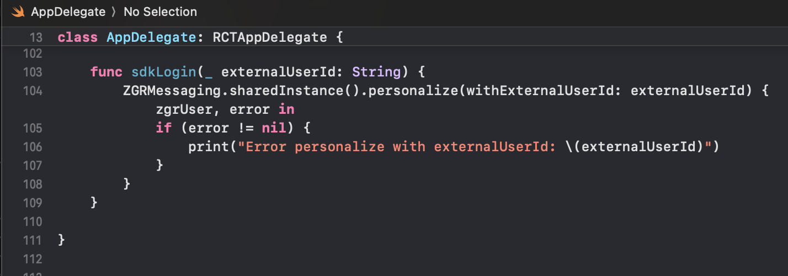
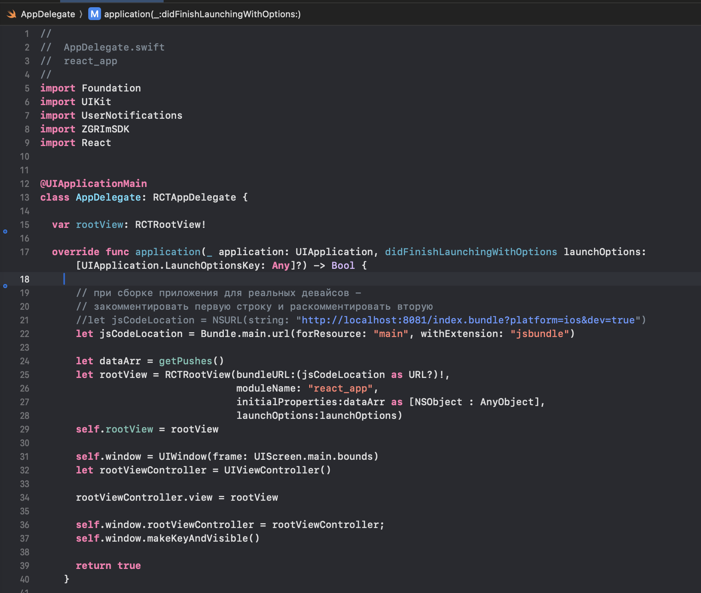

Использование библиотеки ZGRImSDK в мобильном приложении, основанном на фреймворке React Native
=================================================================================================

Рекомендуется тщательно ознакомиться с документацией по React Native: 
* https://reactnative.dev ,
* https://reactnative.dev/docs/communication-ios

Взаимодействие Swift и React Native
----------------------------------------

Для того, чтобы Swift заработал в React Native-проекте, нужно создать bridge-файл. XCode предложит сделать это автоматически при создании первого swift-файла.
Примерное содержание файла *react_app-Bridging-Header.h*:

.. image:: media/rn_1_.png

Взаимодействие между кодом React Native и iOS-частью (obj-C/swift) можно обеспечить с помощью вспомогательного файла Connect.

Допустим, необходимо вызвать из js-кода функцию ``sdkLogin()``, определенную в файле AppDelegate.swift:

В основной папке iOS-части проекта необходимо создать файлы Connect.m и ConnectFile.swift, в которых нужно объявить внешние (extern) по отношению к js-коду методы.  

При разработке каждый экспортируемый в JavaScript элемент должен быть помечен атрибутом ``@objc``, чтобы его можно было использовать в Objective-C runtime.

.. image:: media/rn_4_.png

.. image:: media/rn_5_.png

Также необходимо импортировать NativeModules, и объявить ``const { Connect } = NativeModules;``.

После этого функция sdkLogin() доступна в js-коде через вызов ``Connect.sdkLogin()``:

.. image:: media/rn_6_.png

Библиотека ZGRImSDK в приложении
------------------------------------

Допустим, необходимо в приложении, написанном на React Native, отобразить историю push-уведомлений, полученную с помощью вызова метода ``fetchAllNotifications()`` нашего SDK. Одним из решений может быть использование класса ``RCTRootView``, необходимый массив данных для отображения которому будет передан в качестве параметра ``initialProperties``, как в данном примере:

Код для функции ``getPushes()`` мог бы выглядеть примерно так:

.. image:: media/rn_8_.png
