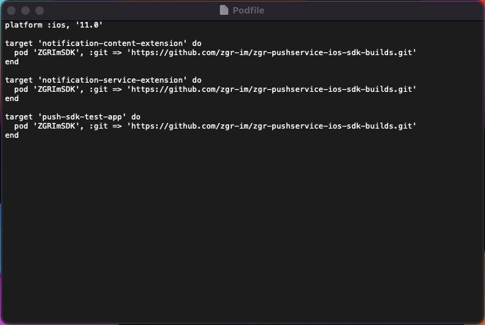
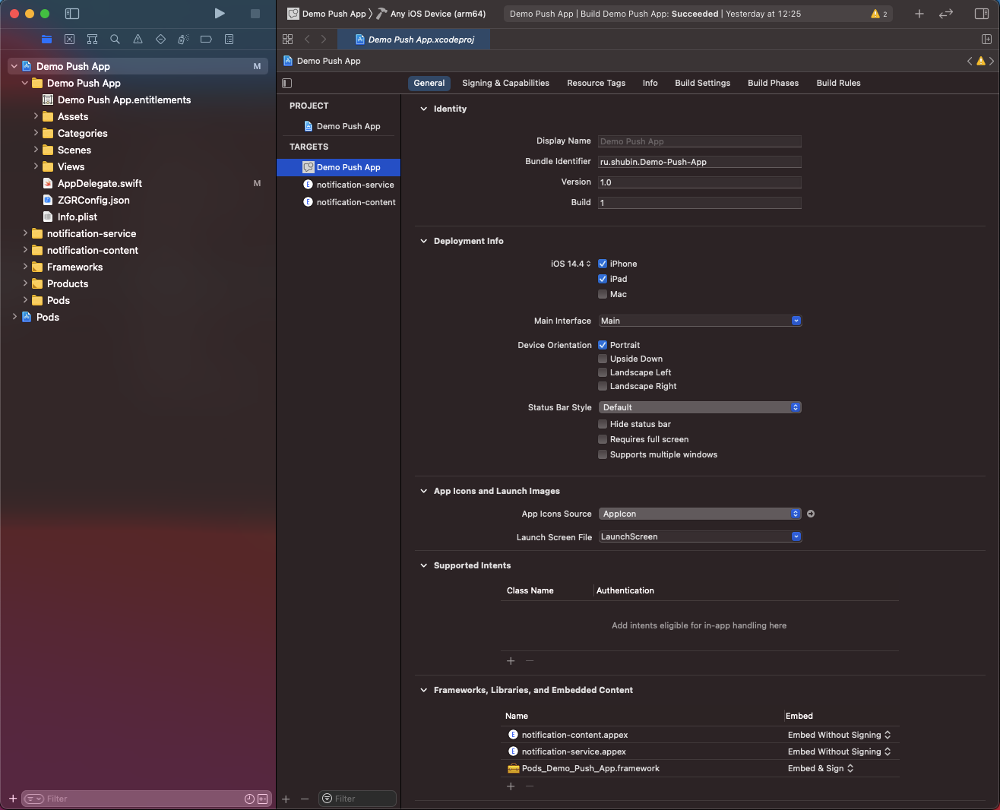

Интеграция библиотеки ZGRImSDK c помощью менеджера пакетов CocoaPods
=======================================================================

Для настройки основного приложения необходимо выполнить следующее:

1. Перетянуть полученный от ZGR конфигурационный файл ``ZGRConfig.json`` в иерархию файлов проекта (левая панель в Xcode).
2. Активировать чек-бокс **“Copy items if needed”**.
3. Создать *podfile* и отредактировать таким образом, чтобы библиотека ``ZGRImSDK.xcframework`` устанавливалась и в основное приложение и в расширения.

    
4. Убедиться, что *pod* c библиотекой будет копироваться в бандл вашего приложения посредством установки пункта **“Embed & Sign”**.

    
Дальнейшие шаги по интеграции библиотеки в части создания и настройка расширений, а также настройки App Group идентичны описанным в статье :doc:`manually_install`, начиная с раздела “Создание и настройка расширений приложения”.
