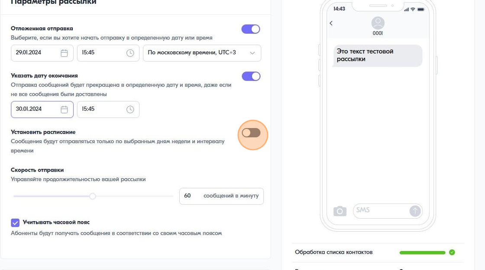

Как настроить и отправить каскадную рассылку
============================================ 
 
 
1\. Создайте рассылку, загрузите список контактов, добавьте и заполните первый канал, например Viber
 
 
2\. Добавьте второй канал
 

 
 
3\. Настройте параметры по которым будет отправляться второе сообщение в каскаде.
 
.. image:: media/sms_sender15.jpeg
 
 
Tip: На примере выше представлен сценарий: "если спустя 5 минут после отправки Viber сообщения не вернулся статус "Доставлено", то отправить SMS"
 
 
4\. Порядок каскада можно изменить перетащив каналы в таблице "Настройки каскада". Просто нажмите на элемент изображенный ниже и перетяните один канал под другой.
 
.. image:: media/sms_sender16.jpeg
 
 
5\. Запустите рассылку после того, как вы закончите все настройки
 
.. image:: media/sms_sender17.jpeg
 
 
