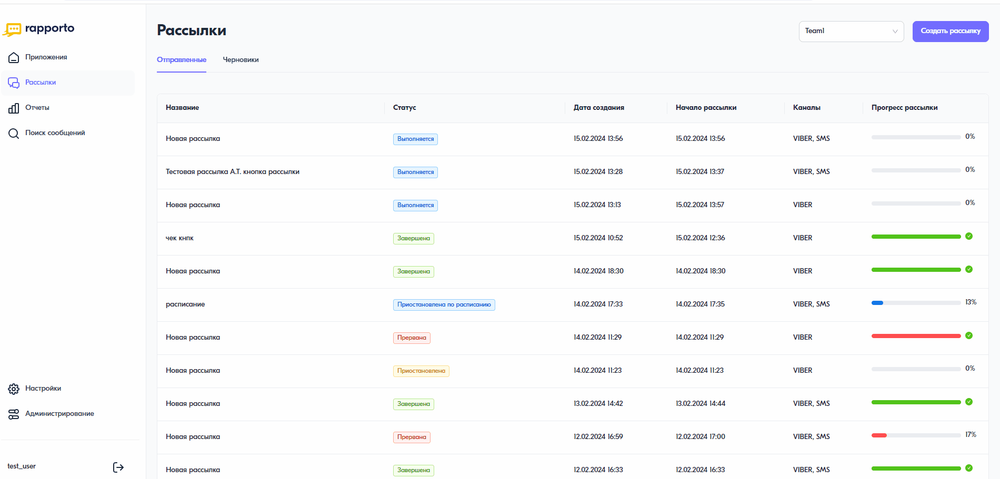

Отправить каскадную рассылку
================================ 
 
Каскадная рассылка — это последовательная отправка сообщений разных типов друг за другом одному и тому же абоненту. Отправка следующего типа сообщений осуществляется, если при доставке предыдущего сообщения не выполнилось заданное условие.

Чтобы запустить каскадную рассылку, необходимо выполнить следующее:
 
1. В личном кабинете перейти в раздел **“Рассылки”**, нажав на соответствующую иконку в левом меню страницы.
 
2. На открывшейся странице в правом верхнем углу нажать на кнопку **<Создать рассылку>**.
 
3. В блоке **“Параметры рассылки”** при необходимости установить требуемые параметры: отложенная отправка, расписание, скорость рассылки. Подробнее в статьях Как создать отложенную рассылку, Как поставить дату окончания рассылки и Как добавить расписание рассылки..
 
4. В блоке **“Получатели”** добавить список контактов — загрузить файл с номерами телефонов или указать их вручную. Подробнее о формировании файла в статье Как создать файл для рассылки. Статус обработки списка контактов, а также информация о валидных и не валидных номерах будет отображена под формой предпросмотра текста сообщения.
 
5. Добавить каналы рассылки: SMS, Viber.

6. В каждом из каналов выбрать имя отправителя и указать текст сообщения. В параметрах Viber-рассылки можно дополнительно загрузить изображение, добавить название кнопки и ссылку, на которую будет вести кнопка. В форме предпросмотра, расположенной справа, будут отображены примеры сообщений. Для переключения между примерами необходимо нажать на соответствующие иконки в данной форме.

7. В блоке **“Настройка каскада”** задать условия, при которых будет запущена каскадная рассылка: указать время ожидания и ожидаемый статус. При необходимости можно изменить очередность каналов рассылки, потянув за нужный канал.

.. note:: На примере ниже представлен сценарий: если спустя 5 минут после отправки Viber-сообщения не вернулся статус "Доставлено", будет отправлено SMS-сообщение.
 
8. Нажать на кнопку запуска рассылки в правом верхнем углу.

 
 
