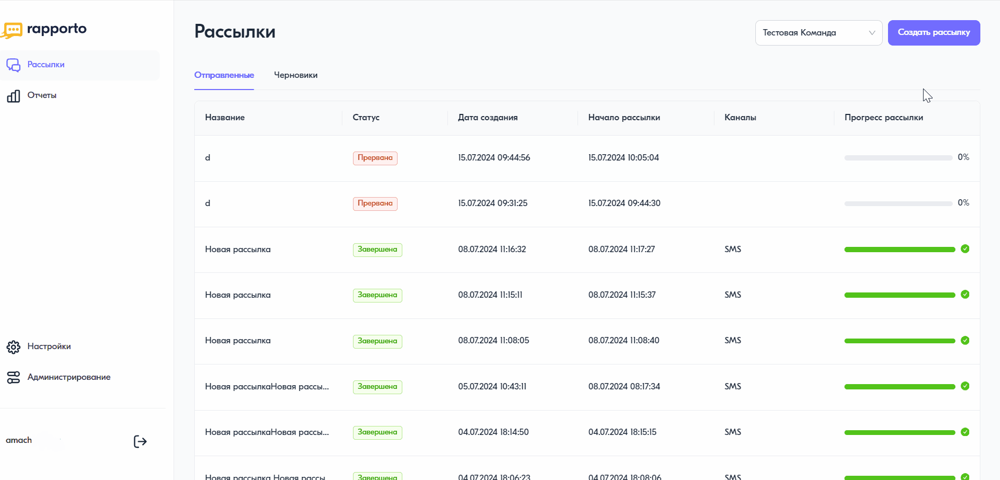

Отправка каскадной рассылки
================================ 
 
.. important:: Каскадная рассылка — последовательная отправка сообщений разных типов одному и тому же абоненту. Отправка следующего типа сообщения производится при недоставке сообщения предыдущего типа.

Для запуска каскадной рассылки необходимо выполнить следующие действия:
 
1. В личном кабинете перейти в раздел **“Рассылки”**, нажав на соответствующую иконку в левом меню страницы.
 
2. На открывшейся странице в правом верхнем углу нажать на кнопку **<Создать рассылку>**.

3. В поле **“Название рассылки”** ввести название рассылки. Максимально допустимое количество символов — 180.
 
4. В блоке **“Параметры рассылки”**, при необходимости, указать значения параметров: отложенная отправка, дата окончания рассылки, расписание (включено по умолчанию), скорость рассылки. Подробнее о данных параметрах в статьях: 

   * :doc:`delayed_sender`; 

   * :doc:`date_of_end`;

   * :doc:`schedule`.
 
5. В блоке **“Получатели”** добавить список контактов — загрузить файл с номерами телефонов или указать их вручную. Подробнее о формировании файла в статье :doc:`file_sender`. Статус обработки списка контактов, а также информация о валидных и невалидных номерах будут отображены под формой предпросмотра текста сообщения.
 
6. Добавить необходимые каналы рассылки. Доступные значения — SMS, Viber, Telegram. Возможность запускать каскадную рассылку зависит от подключенных каналов рассылки.

7. В каждом из каналов выбрать имя отправителя и ввести текст сообщения. В параметрах Viber-рассылки можно дополнительно загрузить изображение, добавить название кнопки и ссылку, которая откроется при нажатии на кнопку. В параметрах Telegram-рассылки можно дополнительно добавить ссылку для перехода. В форме предпросмотра, расположенной справа, будут отображены примеры сообщений. Для переключения между примерами необходимо нажать на соответствующие иконки в данной форме.

8. В блоке **“Настройка каскада”** задать условия, при которых будет запущена каскадная рассылка: указать время ожидания и ожидаемый статус. При необходимости можно изменить очередность каналов рассылки, потянув за левый край строки нужного канала.
 
9. Нажать на кнопку запуска рассылки в правом верхнем углу.

.. note:: На примере ниже представлен сценарий: если спустя 10 минут после отправки SMS-сообщения не вернулся статус “Доставлено”, — будет отправлено Viber-сообщение.

 
 
