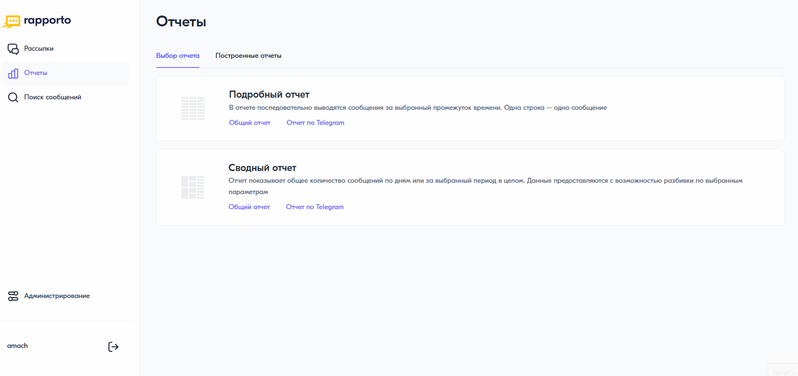

Подробный отчет Telegram
========================

В подробном отчете последовательно (хронологически) выводятся сообщения за выбранный промежуток времени. Одна строка — одно сообщение.

Для построения подробного отчета необходимо выполнить следующее:
 
1. В личном кабинете перейти в раздел **“Отчеты”**, нажав на соответствующую иконку в левом меню страницы.

2. На открывшейся странице выбрать **“Подробный отчет”** — **“Отчет по Telegram”**.
 
3. В блоке **“Период отчета”** выбрать период, за который необходимо построить отчет. Возможные значения:
 
   * Сегодня;

   * Вчера;

   * Последние 7 дней;

   * Текущий месяц;

   * Предыдущий месяц;

   * Вручную — указать произвольный период. Период не должен быть больше 6 месяцев от текущей даты.

4. В блоке **“Фильтры”** при необходимости выбрать фильтр по команде, сервисному имени и статусу сообщений.

5. В блоке **“Настройки таблицы”** установить необходимые параметры отображения отчета:

   * отображать сначала сообщения, отправленные раньше или позже;

   * выбрать колонки отчета. По умолчанию выбрано 7 колонок — дата отправки, дата получения статуса, сервисное имя, номер абонента, статус, текст сообщения, ошибка. По мере добавления или удаления колонок пример отображения отчета будет меняться.

6. Нажать на кнопку **<Построить отчет>**. Начнется формирование отчета.

Сформированный отчет можно скачать на вкладке **“Построенные отчеты”**.

 
