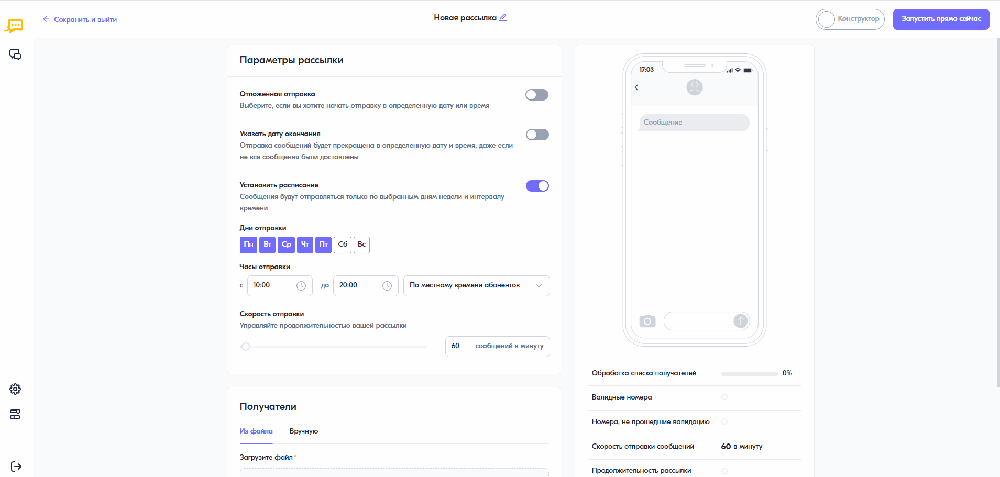

Указание даты окончания рассылки
================================

При создании рассылки с отложенной по дате и времени отправкой есть возможность установить дату и время её окончания. В этом случае отправка сообщений будет прекращена, даже если не все сообщения были доставлены. Чтобы указать дату окончания, необходимо:
 
1. В форме создания рассылки в блоке **“Параметры рассылки”** нажать на переключатель **“Указать дату рассылки”**.
 
2. Выбрать дату и время окончания.
 
.. note:: После завершения рассылки сообщения, которые не были отправлены, получат статус “Не отправлено”. Если сообщение уже было отправлено оператору, то остановить его отправку не получится. В таком случае статистика может изменяться еще некоторое время, потому что не все сообщения получили финальный статус.

