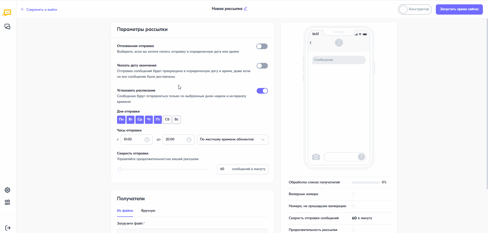

Отправка отложенной рассылки
============================== 

В личном кабинете реализована возможность отправки отложенной рассылки, которая будет выполнена в соответствии с указанными датой и временем старта. Для настройки параметров отложенной отправки рассылки необходимо выполнить следующее:
 
1. В форме создания рассылки в блоке **“Параметры рассылки”** включить переключатель **“Отложенная отправка”**.
 
2. В полях выбора даты и времени указать нужную дату и время запуска рассылки. Рассылка будет запущена по московскому времени, независимо от часового пояса абонента.

3. Нажать на кнопку **<Запустить рассылку в [время] [дата]>**.
 

 
 
