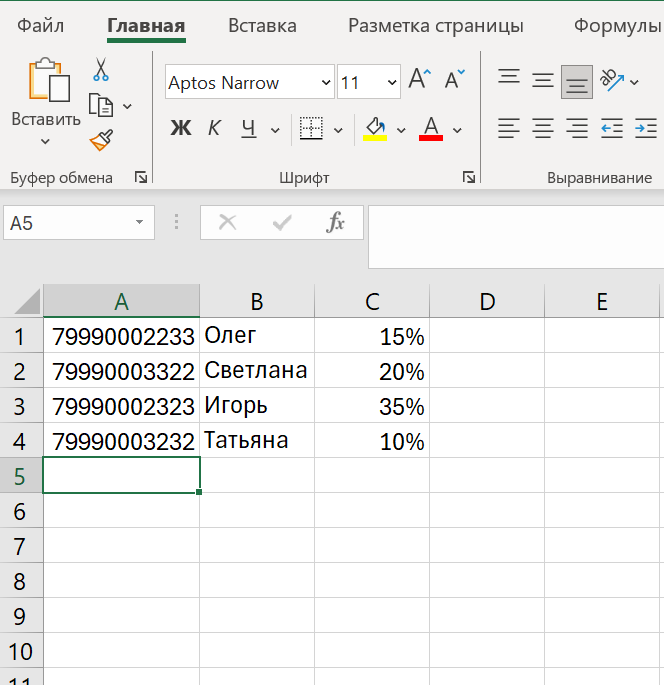

Создание файла для рассылки
=============================

При создании рассылок доступна загрузка номеров абонентов из файла. Максимальный размер файла: не более 128 Mбайт.

Чтобы загружаемый файл был корректно обработан системой, он должен отвечать требованиям, приведенным ниже. Невалидные номера будут автоматически исключены из рассылки. При этом система уведомит о каждом исключенном номере и причине его удаления из рассылки.

Содержание файла отличается в зависимости от типа рассылки:

* файл для рассылок без подстановок содержит только номера телефонов;
* файл для рассылок с подстановками содержит номера телефонов и переменные значения.

Файл для рассылки без подстановок
---------------------------------

При подготовке файла необходимо учесть следующее:

1. Допустимые форматы файла: .csv (разделитель — запятая), .txt, .xls и .xlsx;
2. Для абонентов РФ номер должен состоять из 11 цифр и начинаться с 7. Например, 79990002233;
3. Каждый номер телефона должен располагаться на отдельной строке.

Примеры файлов в разных форматах:

.. cssclass:: no-border-table

    +-----------------------------------------------------+----------------------------------------------+
    | Формат .csv (разделитель — запятая):                | Формат .txt:                                 |
    |                                                     |                                              |
    | .. image:: media/file_sender2.png                   | .. image:: media/file_sender1.png            |
    |     :width: 350                                     |     :width: 350                              |
    +-----------------------------------------------------+----------------------------------------------+
    | Формат .xlsx:                                       |                                              |
    |                                                     |                                              |
    | .. image:: media/file_sender3.png                   |                                              |
    |      :width: 350                                    |                                              |
    +-----------------------------------------------------+----------------------------------------------+

.. _rst-filesender:

Файл для рассылки с подстановками
---------------------------------

При подготовке файла необходимо учесть следующее:

1. Допустимый формат файла: .csv (разделитель — запятая);
2. Для абонентов РФ номер должен состоять из 11 цифр и начинаться с 7. Например, 79990002233;
3. Каждый номер телефона с переменными данными должен располагаться на отдельной строке;
4. В первом столбце — номер телефона, в последующих — переменные значения.

Пример файла с подстановками в формате .csv (разделитель — запятая):

