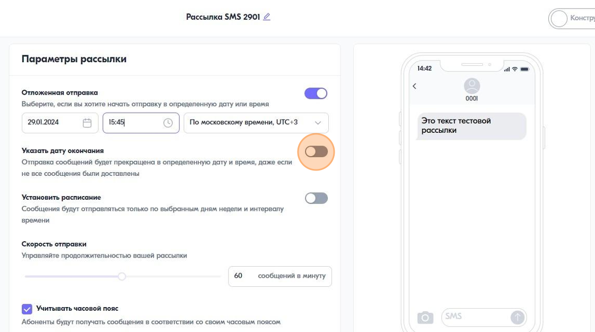
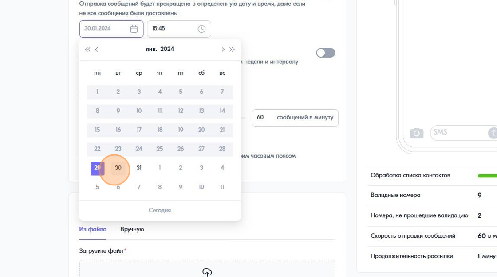

Как поставить дату окончания рассылки
===================================== 

 
1\. Нажмите на переключатель "Указать дату окончания"
 

 
 
2\. Выберите дату и время
 

 
 
.. note:: После завершения рассылки сообщения, которые не были отправятся получат статус "Не отправлено". Если сообщение уже было отправлено оператору, то оставноить его отправку не получится. В таком случае, статистика может изменяться еще некоторое время, потому что не все сообщения получили финальный статус.
 
 
