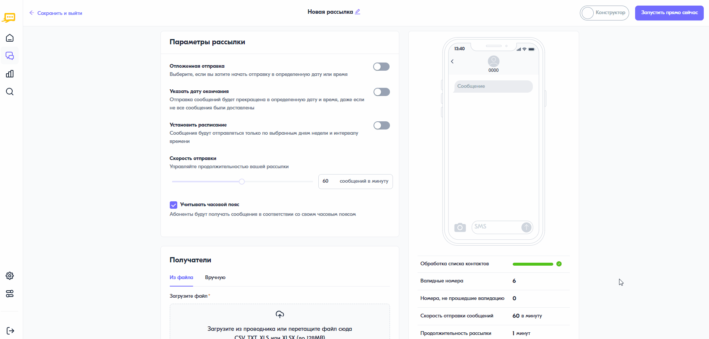

Как отложить отправку рассылки
==============================
 
1\. Перейдите в интерфейс создания рассылки

2\. В разделе **Параметры отправки** включите переключатель **Отложенная отправка**

3\. Укажите дату, время

4\. Выберите по какому часовому поясу должен сработать триггер

    