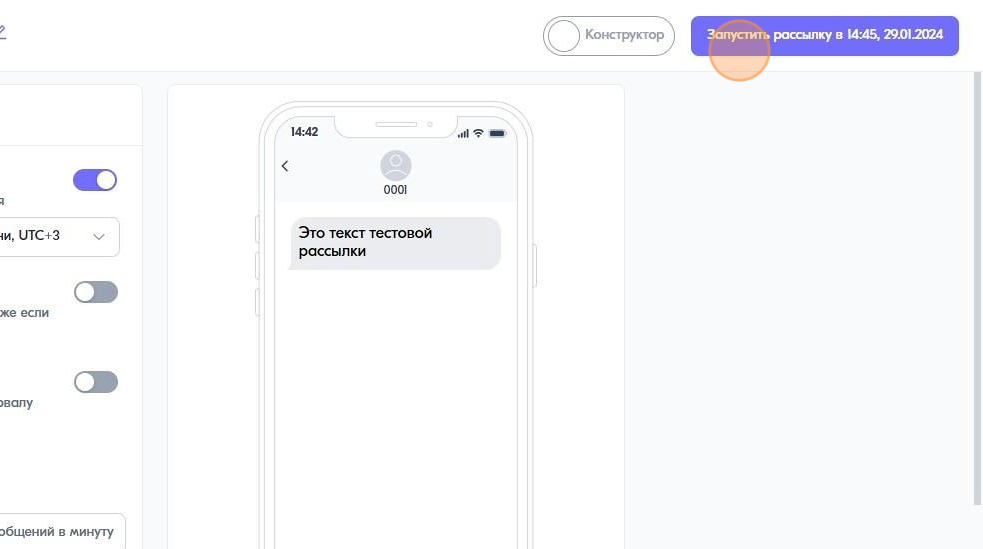
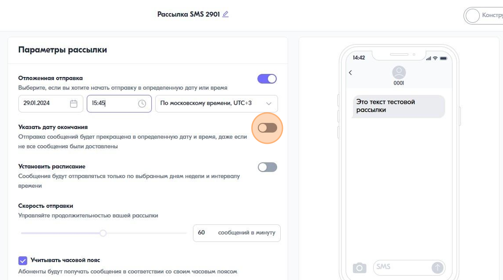
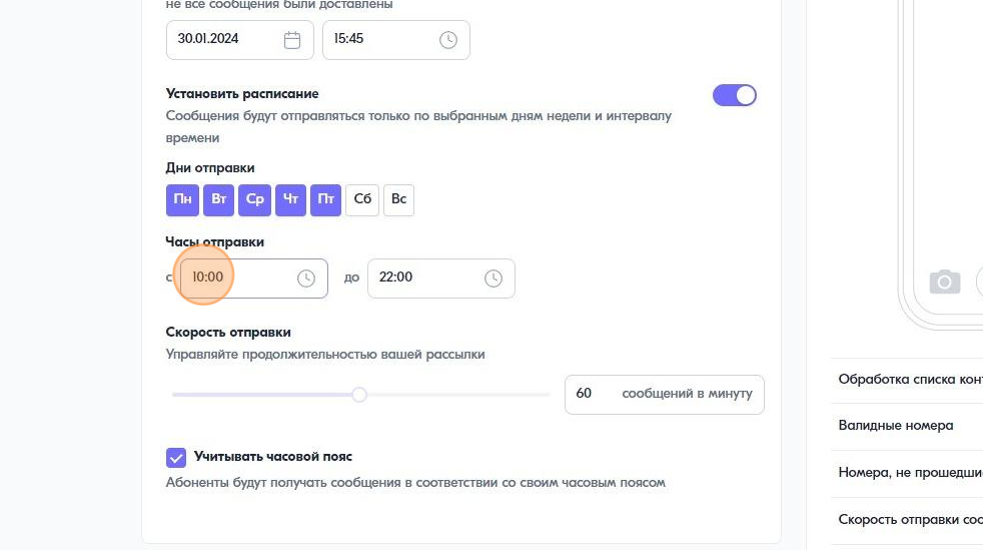
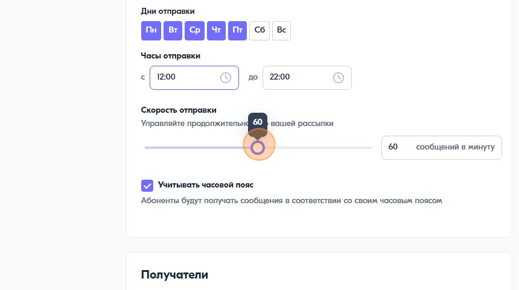

Как отправить отложенную рассылку
=================================
 
 
1\. Нажмите на переключатель "Отложенная отправка"
 
.. image:: media/sms_sender9.jpeg
 
 
2\. Укажите время и дату начала рассылки
 

 
 
3\. Нажмите на кнопку запуска рассылки
 

 
 
Как поставить дату окончания рассылки
------------------------------------------- 
 
4\. Нажмите на переключатель "Указать дату окончания"
 

 
 
5\. Выберите дату и время
 
.. image:: media/sms_sender13.jpeg
 
 
.. note:: После завершения рассылки сообщения, которые не были отправятся получат статус "Не отправлено". Если сообщение уже было отправлено оператору, то оставноить его отправку не получится. В таком случае, статистика может изменяться еще некоторое время, потому что не все сообщения получили финальный статус.
 
 
Как установить расписание отправки
---------------------------------------- 
 
14\. Нажмите на переключатель "Установить расписание"
 
.. image:: media/sms_sender14.jpeg
 
 
15\. Выберите дни и часы отправки сообщений
 

 
 
16\. Укажите скорость отправки рассылки
 

