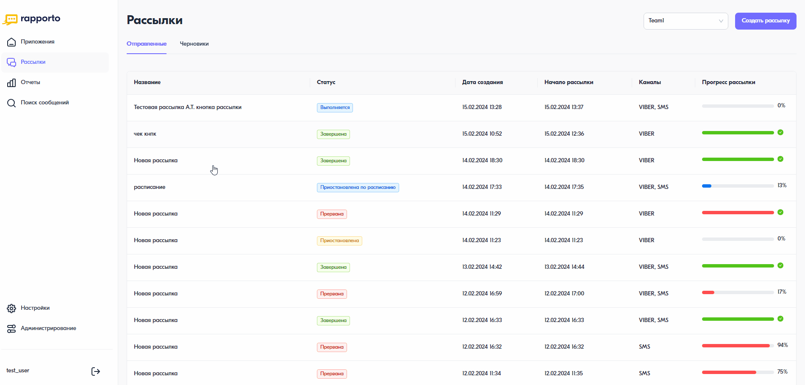

Как посмотреть результаты рассылки
==================================

Для добавления нового пользователя необходимо следующее:

В личном кабинете перейти в раздел “Администрирование”, нажав на соответствующую иконку в левом нижнем углу страницы.

В открывшемся разделе перейти на вкладку “Пользователи” и нажать на кнопку <Добавить пользователя>.

В форме добавления указать email пользователя. На этот электронный адрес будет отправлено приглашение со ссылкой для завершения регистрации. При необходимости можно отправить приглашения сразу нескольким сотрудникам, нажав на “Добавить еще один email”. После того, как пользователь примет приглашение, он появится в списке.

