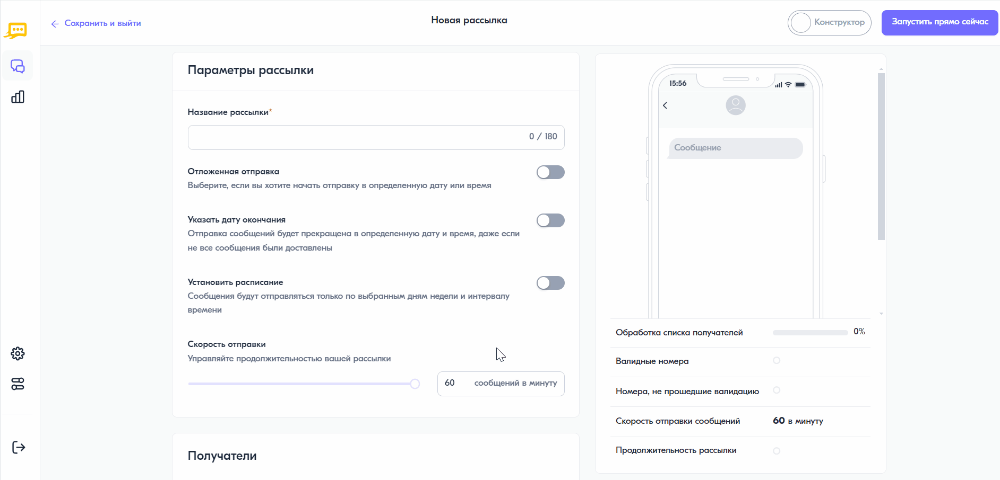

Добавление расписания рассылки
================================

При создании рассылки есть возможность установить ее расписание — отправка будет осуществлена в заданные дни и часы. Для этого необходимо выполнить следующее:

1. В форме создания рассылки в блоке **“Параметры рассылки”** включить переключатель **“Установить расписание”**. 
 
2. Выбрать нужные дни отправки. По умолчанию активированы дни с понедельника по воскресенье включительно.
 
3. Указать часы отправки. По умолчанию задано время с 10:00 до 23:00.
 
4. Из выпадающего списка выбрать часовой пояс, по которому будет осуществлена рассылка. Возможные значения:

   * По московскому времени, UTC+3 — рассылка будет проведена по московскому времени, независимо от часового пояса абонента;
   * По местному времени абонентов — рассылка будет проведена по времени того часового пояса, в котором находится абонент.

5. Указать скорость отправки рассылки.

.. note:: Время начала и окончания, а также скорость рассылки могут быть заданы только в пределах, разрешенных администратором системы.

Если рассылка не успеет отправиться за один день, она продолжится на следующий день согласно установленному расписанию.

