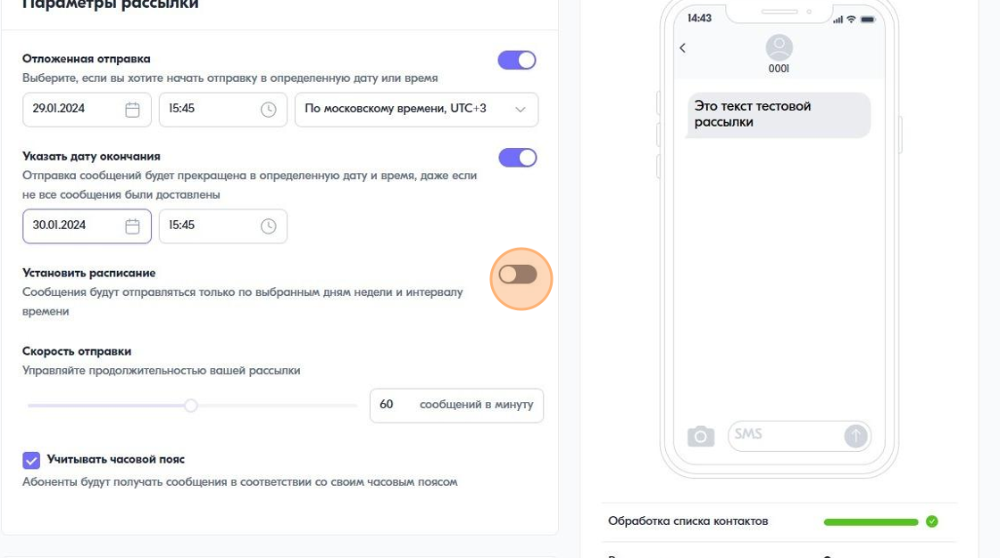
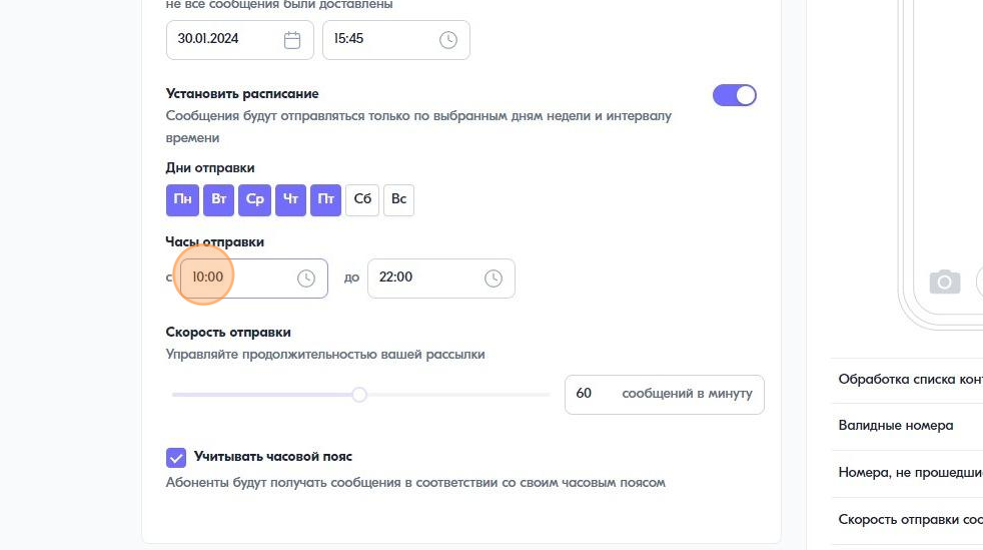
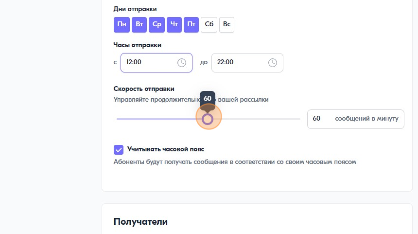

Как установить расписание отправки
================================== 

1\. Нажмите на переключатель "Установить расписание"
 

 
 
2\. Выберите дни и часы отправки сообщений
 

 
 
3\. Укажите скорость отправки рассылки
 

