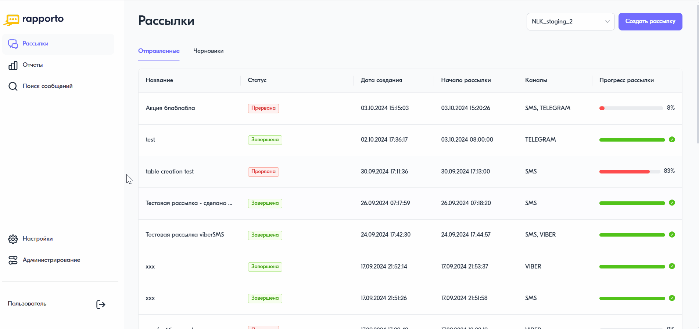

Поиск сообщений
===============

Раздел **“Поиск сообщений”** предназначен для поиска переписки с клиентом. С его помощью можно найти все сообщения, отправленные на тот или иной номер телефона.

Чтобы найти переписку с клиентом, необходимо выполнить следующее:
 
1. В личном кабинете перейти в раздел **“Поиск сообщений”**, нажав на соответствующую иконку в левом меню страницы.

2. На открывшейся странице в поле для ввода указать номер телефона. Для абонентов РФ номер должен состоять из 11 цифр и начинаться с цифры 7, например, 79990002233.
 
3. Выбрать период поиска сообщений. Возможные значения:

   * Вчера;

   * Сегодня (значение по умолчанию);

   * Неделя;

   * Вручную — указать произвольный период. Он не должен быть больше 1 года от текущей даты.

4. С помощью фильтра настроить варианты поиска сообщений. Возможные значения:

   * Вся переписка с абонентом (выбрано по умолчанию);

   * Полученные от абонента;

   * Отправленные абоненту.

5. При необходимости настроить поиск по одной или всем командам. Подробнее о командах в статье :doc:`teams`.

6. Нажать на кнопку **<Найти сообщения>**.

В результате найденная информация отображается в таблице и выводится в столбцах:

* Дата и время — дата и время отправки или получения сообщения от абонента;

* Отправитель — номер отправителя сообщения;

* Получатель — номер получателя сообщения;

* Тип сообщения — SMS, Viber или Telegram;

* Текст сообщения;

* Статус сообщения;

* Время получения статуса;

* Дополнительный статус — в случае Viber и Telegram-сообщений отображается дополнительный статус сообщений. Например, “Просмотрено”.

Если за выбранный период сообщения не найдены, необходимо изменить период или фильтры.

 
