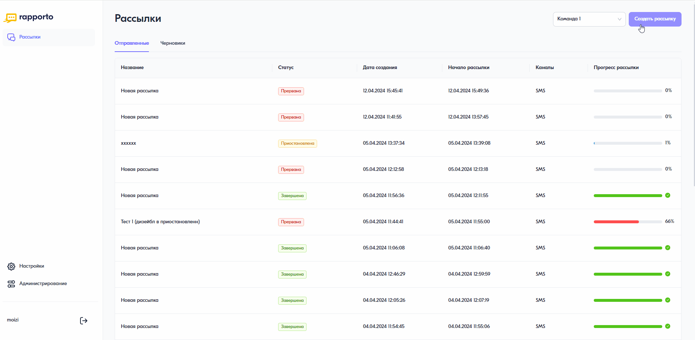

Создание SMS-рассылки
========================

Для создания SMS-рассылки необходимо выполнить следующие действия:
 
1. В личном кабинете перейти в раздел **“Рассылки”**, нажав на соответствующую иконку в левом меню страницы.

2. В открывшемся разделе в правом верхнем углу нажать на кнопку **<Создать рассылку>**.
 
3. Ввести название рассылки, нажав на знак “карандаш” вверху страницы.
 
4. В блоке **“Параметры рассылки”** указать значения необходимых параметров: отложенная отправка, дата окончания или расписание рассылки (включено по умолчанию). Подробнее о данных параметрах в статьях:
 
   * :doc:`delayed_sender`;

   * :doc:`date_of_end`;

   * :doc:`schedule`.

.. note:: Если указанные параметры рассылки противоречат друг другу (например, дата и время старта отложенной отправки раньше даты, указанной в расписании), система временно заблокирует запуск рассылки и выведет предупреждение о необходимости изменить параметры.

5. В блоке **“Получатели”** добавить список контактов — загрузить файл с номерами телефонов или указать их вручную. Для добавления файла необходимо нажать на область для загрузки и выбрать предварительно подготовленный файл со списком контактов (см. :doc:`file_sender`). Чтобы указать номера вручную, нужно нажать на вкладку **“Вручную”** и ввести номера телефонов через запятую, точку с запятой или каждый с новой строки. Для абонентов РФ номер должен состоять из 11 цифр и начинаться с цифры 7, например, 79990002233. После ввода номеров телефонов нажать на кнопку **<Загрузить номера>**. Статус обработки контактов, а также информация о валидных и невалидных номерах будет отображена под формой предпросмотра текста сообщения.
 
6. Добавить канал рассылки — SMS. 
 
7. В открывшейся форме:
 
   * в поле **“Имя отправителя”** выбрать сервисное имя (подпись), которое вы используете для рассылок;
 
   * в поле **“Текст сообщения”** ввести текст сообщения. Счетчик под формой ввода текста отображает количество оставшихся и введенных символов в одной части SMS-сообщения, а также количество частей. Пример сообщения будет отображен в форме предпросмотра текста, расположенной справа. Для автоматического преобразования двойных пробелов в одинарные необходимо на панели инструментов нажать на кнопку **<Удалить лишние пробелы>**.

8. Нажать на кнопку запуска рассылки в правом верхнем углу.

 
