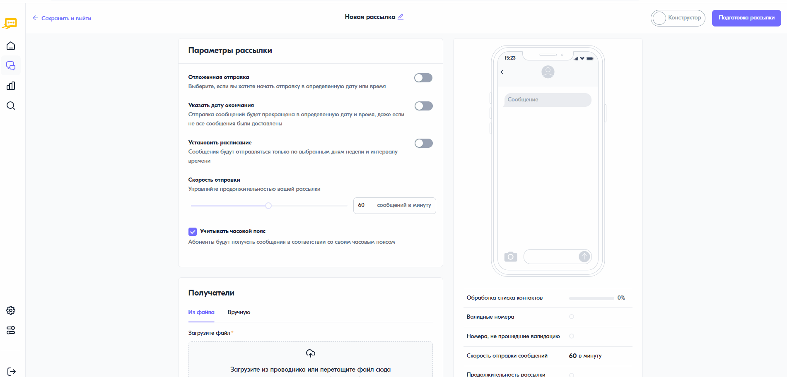

Отправка рассылки с подстановками
======================================

Рассылка с подстановками позволяет направлять абонентам персонализированные сообщения. Перед запуском такой рассылки необходимо подготовить файл с переменными данными (см. :ref:`rst-filesender`).

Чтобы запустить рассылку с подстановками, необходимо выполнить следующее:
 
1. В личном кабинете перейти в раздел **“Рассылки”**, нажав на соответствующую иконку в левом меню страницы.

2. На открывшейся странице в правом верхнем углу нажать на кнопку **<Создать рассылку>**.
 
3. В блоке **“Получатели”** выбрать вкладку **“Из файла”**, нажать на область для загрузки и выбрать предварительно подготовленный файл с данными. После загрузки файла отобразится форма предпросмотра данных, состоящая из нескольких строк. В первом столбце будет указан номер телефона абонента, в последующих (Параметр 1, Параметр 2 и т.д.) — подставляемые значения. Статус обработки списка контактов, а также информация о валидных и невалидных номерах будет отображена под формой предпросмотра текста сообщения.
 
4. Добавить нужный канал рассылки, нажав на соответствующую иконку.
 
5. В открывшейся форме:

   * в поле **“Имя отправителя”** выбрать нужное имя отправителя;
 
   * в поле **“Текст сообщения”** указать текст сообщения с параметрами подстановки. Для вставки данных параметров необходимо в панели инструментов нажать на знак [+] и выбрать нужный параметр или ввести в тексте сообщения символ “[“ и выбрать требуемый параметр из выпадающего списка. При этом в форме предпросмотра, расположенной справа, будет отображен пример сообщения с подстановками.

6. Нажать на кнопку запуска рассылки в правом верхнем углу.
 

 
 
