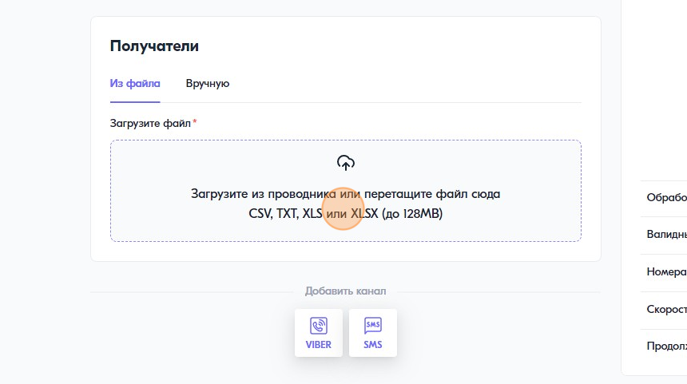
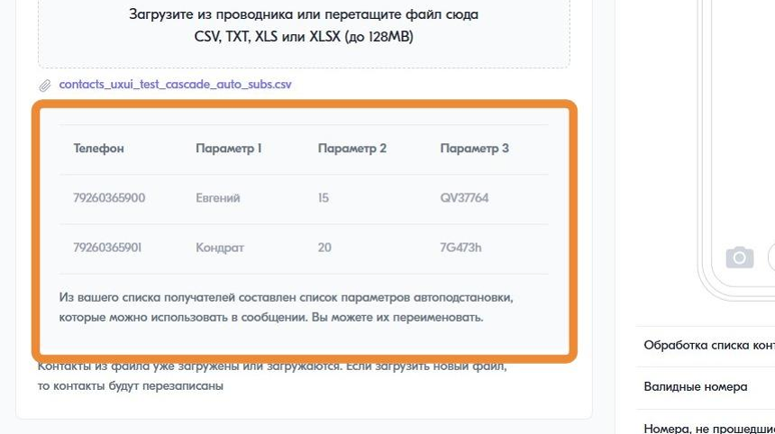
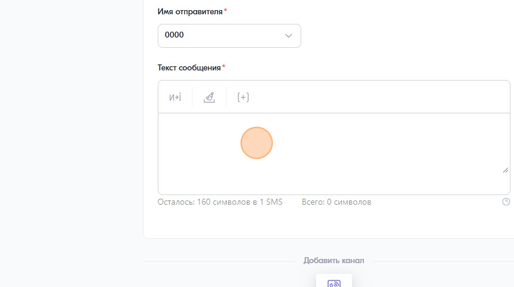
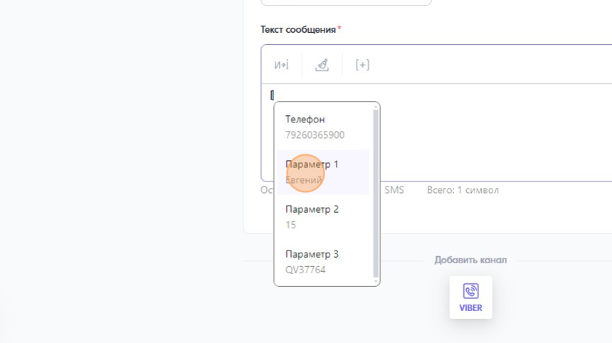
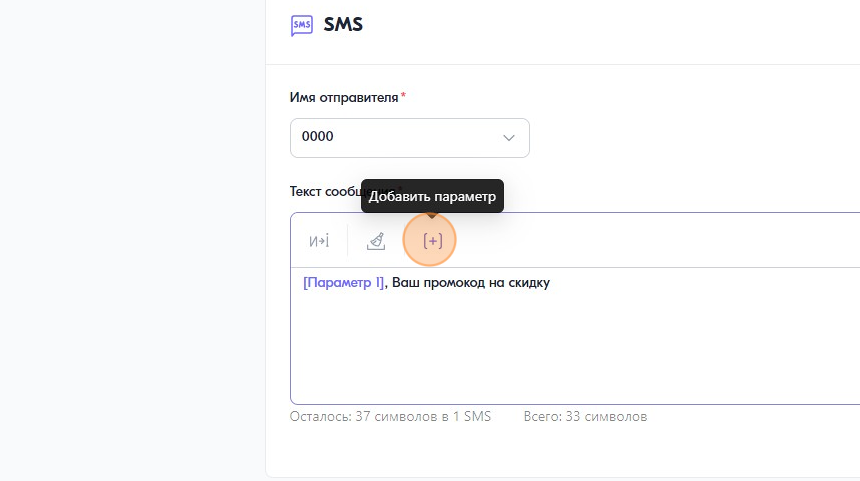
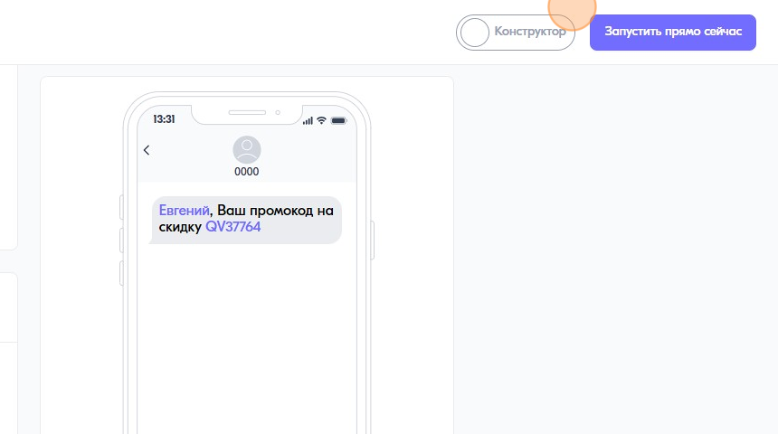

Как создать сообщение с подстановками
=====================================  
 
1\. Создайте рассылку, придумайте ей название и загрузите файл контактов с параметрами подстановки.
 

 
 
2\. После того, как файл будет загружен под зоной загрузки файла появится препросмотр загруженного файла.
 

 
 
3\. Добавьте канал и начните вводить текст.
 

 
 
4\. Чтобы добавить параметры подстановки нажмите "\[" на клавиатуре и выберите параметр из списка.
 

 
 
5\. Альтернативный вариант: нажмите на кнопку "Добавить параметр" в панеле инструментов поля ввода сообщения
 

 
 
6\. Если вы закончили настройку, то запустите рассылку
 

 
 
