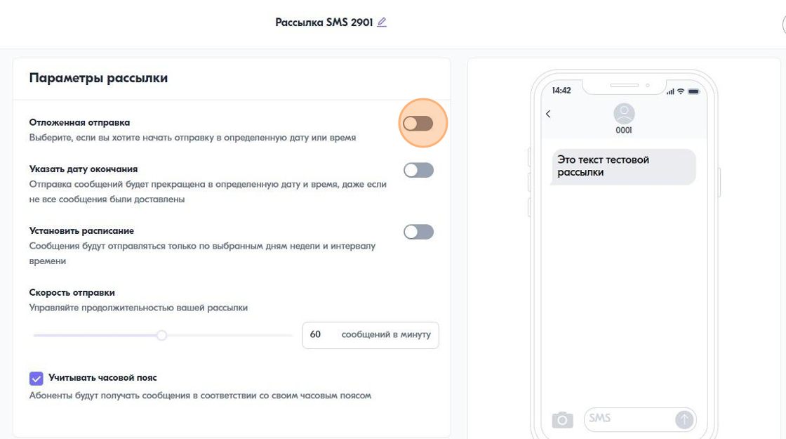

Как отправить Viber-рассылку
============================ 
 
1\. Создайте рассылку и выберите канал Viber
 

 
 
2\. Введите текст сообщения
 
.. image:: media/sms_sender10.jpeg
 
 
3\. Добавьте изображение
 
.. image:: media/sms_sender11.jpeg
 
 
.. tip:: Изображение должно быть в фомате JPG или PNG размером до 300КБ
 
 
4\. Введите название кнопки и ссылку
 
.. image:: media/sms_sender12.jpeg
 
 
.. tip:: Допустимые варианты: только текст, только изображение, текст+кнопка, текст+изображение+кнопка
 
 
5\. Запустите рассылку
 
.. image:: media/sms_sender13.jpeg
 
 
